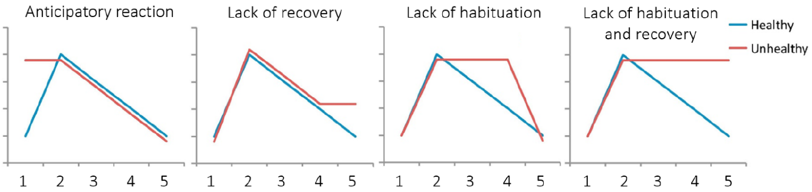
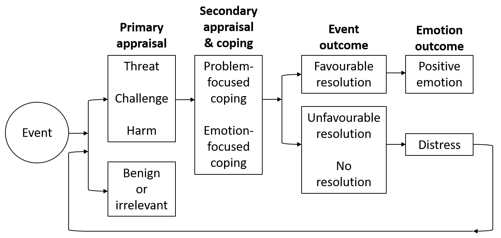
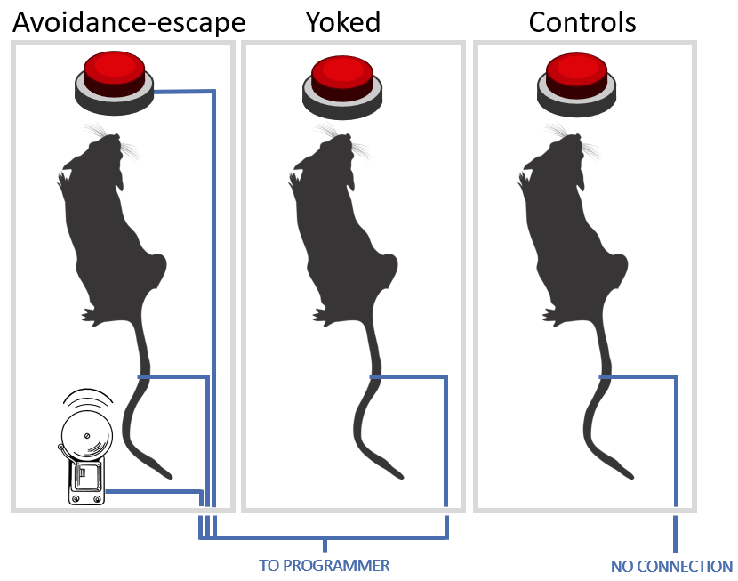

```{r setup, include=FALSE,echo=FALSE}
knitr::opts_chunk$set(collapse = TRUE)
```

Stress is a complex and **multifaceted phenomenon**, involving multiple dimensions placed on **different epistemological levels** investigated by different disciplines (e.g., physics, biology, medicine, psychology). In turn, stress is influenced by several factors of various nature (e.g., biochemical, genetic, psychosocial) with a **transitory** (e.g., exam), **chronic** (e.g., war), and even **dispositional** time course (e.g., anxiety disorder). We are used to think about stress as a negative condition leading to even worse somatic and psychological reactions, but is this always true? That is, when does stress cause illness?

<br>

# Origins of stress research

The term '***stress***' comes from the Latin '***strictus***' (narrow), initially used to describe an elastic body's response (pressure changes called '***strain***', i.e., tension) to an external force. Then, the French physiologist [Claude Bernard (1813-1878)](https://en.wikipedia.org/wiki/Claude_Bernard) started using the term "***estresse***" to characterize the body’s defence reactions to strong external stimulations. Following Berdard's work, the North American physiologist [Walter Cannon (1871-1045)](https://en.wikipedia.org/wiki/Walter_Bradford_Cannon) identified a global response through which the **Autonomic Nervous System** (ANS) reacts to threatening stimuli in order to maintain [homeostasis](https://www.scientificamerican.com/article/what-is-homeostasis/) (the normal physiological balance of the body): the **Alarm Reaction**.


The **Autonomic Nervous System (ASN)** is a component of the peripheral nervous system that is traditionally thought to be **involuntarily controlled** as opposed to the somatic nervous system (although recent evidence highlighted the possibility to voluntarily control some of its components, e.g., using [biofeedback](https://dictionary.apa.org/biofeedback)). The ANS is composed by two branches, both innervating most of our organs and muscles: 

- The **sympathetic nervous system**, characterized by an overall activating function (e.g., phasic heart rate increase, increased muscle oxygenation) to prepare the body to action, that is to elicit the ***fight-or-flight*** response (the Alarm Reaction identified by Cannon).

- The **parasymphatetic nervous system**, with an overall inhibitory function (e.g., tonic heart rate decrease, increased oxygenation of internal organs promoting digestion), sometimes referred as the ***rest-and-digest*** system.

Following Cannon's work, the Austrian endocrinologist [Hans Selye (1907-1982)](https://en.wikipedia.org/wiki/Hans_Selye) identified a **nonspecific and gradual response** to different adverse conditions observed in human subjects (e.g., cold, flu, amputation), and to different nocuous stimulations (e.g., cold temperature, surgical injuries, excessive physical exercise, toxic substances). The **General Adaptation Syndrome** was defined as «*the sum of all nonspecific, systemic reactions of the body which ensue upon long-continued exposure to stress*» [[1]](#references), articulated over three stages:

1. **Alarm reaction** (from Cannon's work), characterized as a short-term adaptive response resulting in increased energy availability and immune defense (fight-or-flight).

2. **Resistance**, that is when the exposure is prolonged, the response can be sustained over time, and the organism increasingly adapts.

3. **Exhaustion**: last stage characterizing exposures prolonged for several weeks/months, resulting in severe damage to the body (e.g., intestinal ulcers) and increased vulnerability to both the original and other stressful stimuli, with higher chance of illness and death.

# 🚨 &rightarrow; ✊  &rightarrow; 🪫  

<br>

# The stress response

Selye and Cannon were the first acknowledging the **multilevel nature of the stress response**, involving complex interactions between the nervous and the endocrine systems, and with implications at the immune level. They contributed to the definition of more holistic approaches to stress research, such as the **Psycho-Neuro-Endocrino-Immunology** (long name, I know), studying the interactions between behavioral (e.g., fight-or-flight response), neural (e.g., ANS, prefrontal cortex), endocrine (e.g., cortisol), and immune systems (e.g., proinflammatory cytokines).

Decades of research resulted in a very detailed characterization of the **stress response** (at least its "NEI" part). This mainly involves two neuroindocine axes: \color{red} the sympathetic-adrenal-medullary (SAM, in red below) \color{black} and \color{teal} the hypothalamo–pituitary–adrenocortical (HPA, in green below)\color{black}.


The **SAM axis** is called «the fast pathway» because it is mainly based on the nervous system (electrical signals): sensorial information from the perceptual system are processed by the thalamic nuclei, transmitted to the **amygdala**, forwarded to the **hypothalamus** and the locus coeruleus (releasing noradrenaline, NA). From the hypotalamus, a first direct and rapid response (t1, taking a few seconds) activates the "fight-or-flight" symphato-motor response, followed by a second response mediated by the **adrenal medullas** (the internal part of the adrenal glands, placed over the kidneys), releasing **adrenaline** (A) and **noradrenaline** (NA) into the blood stream, and prolonging the response over some minutes.

The **HPA axis** is called «the slow pathway» because it's mainly mediated by the endocrine system (hormal signals through the blood stream), which takes more time than electical signals. It also originates from the **hypothalamus**, which releases the CRH hormone, stimulating the **pituitary gland** (hypophysis) to release the ACTH hormone into the blood stream to the adrenal cortexes (at this time, the external part of the adrenal glands), releasing  the **glucocordicoids** (including **cortisol**) into the blood stream. These are so-called because they impact on glucose metabolism, increasing energy availability.

<br>

# When does stress cause illness?

In both Cannon and Selye's view, and consistently with decades of research, **the stress response is an adaptive response** that is functional to cope with changing environmental demands, and thus to the survival of the species. In Selye's words, stress is not a pathological state, but rather «*the [natural] wear and tear of the body [...] caused by any type of vital reaction in any moment*» [[1]](#references). That is, you cannot live without being stressed, [unless you're sleeping](https://lucamenghini.netlify.app/psychophysiology-of-sleep-and-relationships-with-stress-and-job-stressors/). According to modern research, what makes an usually adaptive response (**eustress**) a potentially unhealthy condition (**distress**) are the timing, frequency, and nature of our stress responses.

## The Allostatic Load Theory

Starting from Cannon, stress research focused on the concept of **homeostasis**, that is the body’s ability to **maintain the ‘set points’** of its physiological processes (e.g., basal blood pressure) through negative feedback mechanisms (e.g., baroceptors). In other words, the homeostasis framework posits that our body is programmed for returning to its **baseline** after any stressful event. 

In contrast, modern stress theories are mostly based on the concept of **allostasis**, that is **adaptation through change**, based on which our biological set points are modified and overwritten by neuroendocrine circuits (such as SAM & HPA) to anticipate environmental demands. For instance, living in a war scenario would require our body to be particularly ready to "fight or flight", to rapidly provide us with the necessary metabolical resources for handling acute stressors. Thus, rather than restarting each day from our baseline, it is more adaptive to **increase our basal activation levels**, so that each day we start from a slightly higher level, requiring less time and energy to reach our peak.

According to the Allostatic Load Theory [[2]](#references), the biological cost of this adaptation is the **allostatic load**, which precisely matches with Selye's idea of «*‘body wear and tear’*». The figure below summarizes the main scenarios/types of allostatic load, possibly originating from (1) the repeated or prolonged exposure to stressors (**repeated hits**), (2) the **lack of adaptation** to stressors that are repeatedly encountered, (3) the lack of adequate recovery following the exposure (**prolonged response**), and (4) the insufficient activation of some components of the stress response (**inadequate response**), leading to the over-reactivity of other components. Whereas in the short-term these scenarios imply primary and reversible changes (basically the same adaptive changes described above), in the long run they can lead to more stable and irreversible secondary changes (e.g., permanently increased basal blood pressure) and **tertiary disease endpoints** (e.g., hypertension, coronary hearth disease).


<br>

## Reactivity vs. prolonged activation

The allostatic load theory satisfactorily answer the question *When does stress cause illness?*. Yet, a further advancement in stress research that is worthy of mention is the shift from reactivity to prolonged activation.

For decades, stress research has been mainly focused on the concept of **physiological reactivity**, that is the intensity of physiological responses *concomitant* or immediately following the exposure to stressors. Based on the **reactivity hypothesis**, stress causes illness mainly due to exaggerated responses to stressors. For instance, *hyper-reactivity* has been associated with certain personal dispositions such as hostility, Type A behavior, and anxiety disorders. When individuals overreact to stressors, exaggerated acute activation is more likely to result in the exhaustion phase of the GAS, to trigger allostatic load, and to cause disease endpoints such as strokes and ictus. Focusing on short-term reactions, stress research has deeply investigated the main individual characteristics predictive of deviations from the 'normal' stress response. This is nicely shown by the figure below (adapted from [[3]](#references)).



While physiological reactivity is certainly an important aspect to be considered, some researchers noticed that most reactivity responses documented in the literature are all in all quite comparable to the kind of physiological activation we can experience during **moderate/vigorous physical exercise**. And we all agree that physical exercise is not (generally) dangerous for health, but quite the opposite. So how can it be that physiological reactivity leads to illness?

A possible answer to this question focuses on the third type of allostatic load, namely the **prolonged response** that is experienced when stress is followed by **inadequate recovery**. Stress and recovery are the two complementary processes at the core of the homeostasis concept: environmental demands trigger physiological activation providing the necessary resources to cope with the stressors; then, once stressors have been successfully handled, the parasympathetic nervous system activates to make us rest, return to the baseline, and recover the resources needed for future stress responses. Such a physiological process is also strictly linked to our circadian rhythms and to the '**cycle of work and rest**' that is [better described in this post](/sleep-recovery-and-recovery-experiences/).

According to the **perseverative cognition hypothesis** [[4]](#references), stress responses cause illness when they are prolonged outside the stressful exposure, when we should recover. This framework moves its focus from the acute response experienced *during* a stressful event to the associated **prolonged activation**, defined as the total amount of physiological activation over time, either **before** (*anticipatory responses*) or **after** the exposure (*inadequate recovery*). Coming back to the comparison with physical exercise, it is adaptive to physiologically activate during a training session. However, to benefit from the effects of training we need to rest before starting a new session. If we keep being in a 'stress mode' during such a critical recovery period, we put our body over its limits, and we can get sick or injured.

But what can make us stressed when we are not actually facing a stressor? To answer this question, we need to introduce the **psychological facets of the stress response**, and particularly the concept of *appraisal* and *perseverative cognitions*.

# Psychology of the stress response

Starting from the 70s, there has been a boom in the research on the **psycho-social factors** involved in the stress response. Using [Richard Lazarus (1922-2002)](https://en.wikipedia.org/wiki/Richard_Lazarus) and [Susan Folkman](https://en.wikipedia.org/wiki/Susan_Folkman)'s words, the core idea behind such lines of research is that “individual and group differences in the degree and kind of stress reaction are always evident”. So what makes an individual *feeling stressed* when another individual does not?

Lazarus and Folkman's **transactional model of stress** [[5]](#references) can be thought as the foundation of psychology research on stress. The model describes stress as "*a particular relationship* - a **transaction**, an exchange of resources - *between the person and the environment that is appraised by the person as taxing or exceeding his or her resources and endangering his or her well-being*". When we face a stressor, we enter in a **primary appraisal** process where we subjectively evaluate whether the stimulus or the event is stressful (harm, threat, or challenge) or rather benign or irrelevant. In the former case we enter in a **secondary appraisal** process where we subjectively evaluate whether we're able to cope with the stressor or not. Based on this model, we are "*under stress*" (or *distress*) only when we perceive to be unable to cope with a stimulus that we consider as a stressor. But of course, different individuals will provide different subjective evaluations (and thus, different responses) in the exact same conditions.



## Control and predictability

Further research focused on specific facets of cognitive appraisal, such as the **perceived control** over the situation and the **predictability** of its consequences. In the Basic Triplet Paradigm [[6]](#references), three rats were placed in three separate electrified cages. The first rat gets electric shocks at random time points, but always preceded by an acoustic signal (*predictability*) and stoppable by pressing a button (*control*). The second rat is connected to the former, and gets shocked any time the former is, but without being able to predict or control the shocks. The results reported from this experiment showed worse stress-related health outcomes (e.g., gastric ulcers) in the latter than in the former condition and compared to controls (rats not receiving any shock). 



Later developments in human cognition [[7]](#references) further highlighted the importance of such facets of **cognitive appraisal**, defining stress as the *perceived discrepancy* between what we expect and what we actually experience. Over time, it can happen that some people start feeling that there is no link between their efforts and the outcome of a stressor (a clinical condition named *helplessness*) or that any strategy would lead to negative results (*hopelessness*), with potentially serious implications for their mental health. 

Furthermore, appraisals carry out in a **social environment** where other people's subjectivity and the structure of our social relationships can exert a powerful influence. For instance, we can receive **social support** by a friend that help us interpreting a situation from a different perspective and/or provide us with additional resources to cope with the stressor.

## Perseverative cognitions

While most psychological theories of stress focus on the cognitive and emotional processes carrying out *during* acute stress responses, they all recognize that it is the **chronic course** of stress that leads to the most serious consequences. This takes us back to the concept of **prolonged activation** introduced above. What make us chronically stressed over time, compromising our recovery, and activating the stress response even in stressor-free conditions?

According to the **perseverative cognition hypothesis** [[4]](#references), stress causes illness mainly through anticipatory responses *before* a stressful event and inadequate recovery *after* the event. And this **prolonged activation** happens because our cognitive representation of the event (its image in our mind) is activated regardless of the actual presence of the stressor. Such "*repeated or chronic activation of the cognitive representation of one or more psychological stressors*” are called **perseverative cognitions** and we can experience them on a daily basis when we **ruminate** about past stressors (like cows eating grass, we repeatedly recall what happen) or **worry** about future stressors (such as the night before an exam or a job interview).

# So what's stress and how does it cause illness?

This post attempted to provide some partial answers to these two critical questions. A straightforward definition of stress is difficult to formulate due to the many biological and psychological processes involved in the stress response. We know it's an **aspecific** (similar reaction to different stimuli), **progressive** (triggering different biological effects at different time points), and **cumulative** response (leading to progressively severe health outcomes over time). It is mediated by **subjective appraisal** and other cognitive and affective processes affected by individual characteristics (personality, memory, etc.) and the social environments (social support, social status, etc.). Although the question "*how does stress cause illness*" remains partially unanswered, there is evidence that **prolonged activation** experienced when we should recover plays a major role in the pathogenic nature of stress. And **perseverative cognitions** such as rumination and worry are so far the best guess for the most critical psychological processes leading from stress to ill health.

# Why is this important for work and organizational psychology?

We saw that stress can be potentially experienced in any activity (even during free time), but the stressful activity that is more likely to be reported by an average adult in our historical period is undoubtedly **work**. Work is the Activity par excellence. Our life, social relationships, and circadian rhythms are fundamentally determined by our job schedule. Most of our metabolical, psychological, and social resources are directed to our work activities, and the term "**leisure**" is used as both a synonym of recovery and as the opposite of work.

## Assessing workplace stress

## Magaging workplace stress

Something about Management Standards, HSE and INAIL.

Primary, secondary and tertiary prevention

# References

1.  Selye, H. (1956). *The stress of life*. McGraw-Hill.

2. McEwen, B. S. (1998). Protective and Damaging Effects of Stress Mediators. *New England Journal of Medicine, 338*(3), 171–179. https://doi.org/10.1056/NEJM199801153380307

3. Epel, E. S., Crosswell, A. D., Mayer, S. E., Prather, A. A., Slavich, G. M., Puterman, E., & Mendes, W. B. (2018). More than a feeling: A unified view of stress measurement for population science. *Frontiers in Neuroendocrinology, 49*, 146–169. https://doi.org/10.1016/j.yfrne.2018.03.001

4. Brosschot, J. F., Pieper, S., & Thayer, J. F. (2005). Expanding stress theory: Prolonged activation and perseverative cognition. *Psychoneuroendocrinology, 30*(10), 1043–1049. https://doi.org/10.1016/j.psyneuen.2005.04.008

5. Lazarus, R. S., & Folkman, S. (1984). *Stress, Appraisal, and Coping*. Springer Publishing Company.

6. Weiss, J. M. (1972). Psychological Factors in Stress and Disease. *Scientific American, 226*(6), 104–113. https://doi.org/10.1038/scientificamerican0672-104

7. Ursin, H., & Eriksen, H. R. (2010). Cognitive activation theory of stress (CATS). *Neuroscience & Biobehavioral Reviews, 34*(6), 877–881. https://doi.org/10.1016/j.neubiorev.2009.03.001