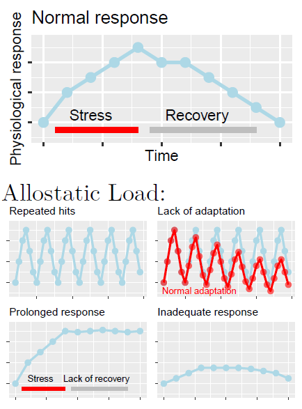

```{r setup, include=FALSE,echo=FALSE}
knitr::opts_chunk$set(collapse = TRUE)
```

Stress is a complex and **multifaceted phenomenon**, involving multiple dimensions placed on **different epistemological levels** investigated by different disciplines (e.g., physics, biology, medicine, psychology). In turn, stress is influenced by several factors of various nature (e.g., biochemical, genetic, psychosocial) with a **transitory** (e.g., exam), **chronic** (e.g., war), and even **dispositional** time course (e.g., anxiety disorder).

<br>

# Origins of stress research

The term '***stress***' comes from the Latin '***strictus***' (narrow), initially used to describe an elastic body's response (pressure changes called '***strain***', i.e., tension) to an external force. Then, the French physiologist [Claude Bernard (1813-1878)](https://en.wikipedia.org/wiki/Claude_Bernard) started using the term "***estresse***" to characterize the body’s defence reactions to strong external stimulations. Following Berdard's work, the North American physiologist [Walter Cannon (1871-1045)](https://en.wikipedia.org/wiki/Walter_Bradford_Cannon) identified a global response through which the **Autonomic Nervous System** (ANS) reacts to threatening stimuli in order to maintain [homeostasis](https://www.scientificamerican.com/article/what-is-homeostasis/) (the normal physiological balance of the body): the **Alarm Reaction**.


The **Autonomic Nervous System (ASN)** is a component of the peripheral nervous system that is traditionally thought to be **involuntarily controlled** as opposed to the somatic nervous system (although recent evidence highlighted the possibility to voluntarily control some of its components, e.g., using [biofeedback](https://dictionary.apa.org/biofeedback)). The ANS is composed by two branches, both innervating most of our organs and muscles: 

- The **sympathetic nervous system**, characterized by an overall activating function (e.g., phasic heart rate increase, increased muscle oxygenation) to prepare the body to action, that is to elicit the ***fight-or-flight*** response (the Alarm Reaction identified by Cannon).

- The **parasymphatetic nervous system**, with an overall inhibitory function (e.g., tonic heart rate decrease, increased oxygenation of internal organs promoting digestion), sometimes referred as the ***rest-and-digest*** system.

Following Cannon's work, the Austrian endocrinologist [Hans Selye (1907-1982)](https://en.wikipedia.org/wiki/Hans_Selye) identified a **nonspecific and gradual response** to different adverse conditions observed in human subjects (e.g., cold, flu, amputation), and to different nocuous stimulations (e.g., cold temperature, surgical injuries, excessive physical exercise, toxic substances). The **General Adaptation Syndrome** was defined as «*the sum of all nonspecific, systemic reactions of the body which ensue upon long-continued exposure to stress*» [[1]](#references), articulated over three stages:

1. **Alarm reaction** (from Cannon's work), characterized as a short-term adaptive response resulting in increased energy availability and immune defense (fight-or-flight).

2. **Resistance**, that is when the exposure is prolonged, the response can be sustained over time, and the organism increasingly adapts.

3. **Exhaustion**: last stage characterizing exposures prolonged for several weeks/months, resulting in severe damage to the body (e.g., intestinal ulcers) and increased vulnerability to both the original and other stressful stimuli, with higher chance of illness and death.

# 🚨 &rightarrow; ✊  &rightarrow;  🪫


<br>

# The stress response

Selye and Cannon were the first acknowledging the **multilevel nature of the stress response**, involving complex interactions between the nervous and the endocrine systems, and with implications at the immune level. They contributed to the definition of more holistic approaches to stress research, such as the **Psycho-Neuro-Endocrino-Immunology** (long name, I know), studying the interactions between behavioral (e.g., fight-or-flight response), neural (e.g., ANS, prefrontal cortex), endocrine (e.g., cortisol), and immune systems (e.g., proinflammatory cytokines).

Decades of research resulted in a very detailed characterization of the **stress response** (at least its "NEI" part). This mainly involves two neuroindocine axes: \color{red} the sympathetic-adrenal-medullary (SAM, in red below) \color{black} and \color{teal} the hypothalamo–pituitary–adrenocortical (HPA, in green below)\color{black}.


The **SAM axis** is called «the fast pathway» because it's mainly based on the nervous system (electrical signals): sensorial information from the perceptual system are processed by the thalamic nuclei, transmitted to the **amygdala**, forwarded to the **hypothalamus** and the locus coeruleus (releasing noradrenaline, NA). From the hypotalamus, a first direct and rapid response (t1, taking a few seconds) activates the "fight-or-flight" symphato-motor response, followed by a second response mediated by the **adrenal medullas** (the internal part of the adrenal glands, placed over the kidneys), releasing adrenaline (A) and noradrenaline (NA) into the blood stream, and prolonging the response over some minutes.

The **HPA** is called «the slow pathway» because it's mainly mediated by the endocrine system (hormal signals through the blood stream), which takes more time than electical signals. It also originates from the **hypothalamus**, which releases the CRH hormone, stimulating the **pituitary gland** (hypophysis) to release the ACTH hormone into the blood stream to the adrenal cortexes (at this time, the external part of the adrenal glands), releasing  the **glucocordicoids** (including **cortisol**) into the blood stream. These are so-called because they impact on glucose metabolism, increasing energy availability.

<br>

# How does stress cause ilness?

In both Cannon and Selye's view, and consistently with decades of research, **the stress response is an adaptive response** that is functional to cope with changing environmental demands, and thus to the survival of the species. In Selye's words, stress is not a pathological state, but rather «*the [natural] wear and tear of the body [...] caused by any type of vital reaction in any moment*» [[1]](#references). That is, you cannot live without being stressed, [unless you're sleeping](https://lucamenghini.netlify.app/psychophysiology-of-sleep-and-relationships-with-stress-and-job-stressors/). According to modern research, what makes an usually adaptive response (**eustress**) a potentially unhealthy condition (**distress**) are the timing, frequency, and nature of our stress responses.

## The Allostatic Load Theory

Starting from Cannon, stress research focused on the concept of **homeostasis**, that is the body’s ability to **maintain the ‘set points’** of its physiological processes (e.g., basal blood pressure) through negative feedback mechanisms (e.g., baroceptors). Whereas modern stress theories are mostly based on the concept of **allostatis**, that is **adaptation through change**, based on which the biological set points are modified and overwritten by neuroendocrine circuits (such as SAM & HPA) in order to better adapt to the environment, and to anticipate environmental demands. For instance, a stable passage from a peace to a war scenario would require our body to be particularly ready to "fight or flight", implying the need for increased reactivity and higher basal levels of physiological activation.

According to the Allostatic Load Theory [[2]](#references), the biological cost of this adaptation is the **allostatic load**, which precisely identifies Selye's idea of «*‘wear and tear’ of the body*».



<br>

# Psychological processes in the stress response

<br>

# So what's stress?

<br>

# Workplace stress

## Assessing workplace stress

## Magaging workplace stress

Something about Management Standards, HSE and INAIL.

Primary, secondary and tertiary prevention

# References

1.  Csikszentmihalyi, M., & Larson, R. (2014). Validity and reliability of the experience-sampling method. In *Flow and the foundations of positive psychology* (pp. 35-54). Springer, Dordrecht.