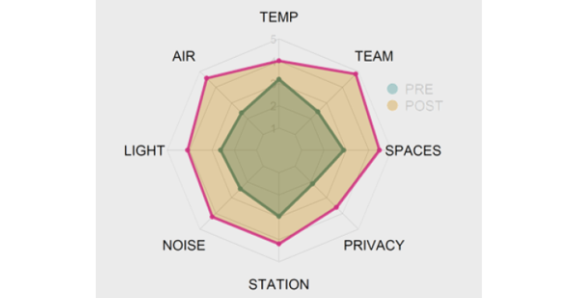

The consulting research conducted for [Consorzio per il Trasferimento Tecnologico C2T](https://www.consorzioc2t.it/progetti/) aimed to evaluate the impact of changes in workplace characteristics on multiple **psychophysiological indicators of healh and well-being**. The research was conducted with a group of workers who were about to undergo a series of **changes in their workplace spaces**, particularly in the lighting system, the aesthetics of the spaces, and the office layout.

The scientific literature highlighted a **prominent role of the physical workplace characteristics for employee health and well-being** [[1-2]](#references). For instance, lighting levels are notably relevant for the optimal performance of work activities (e.g. to avoid eye strain and improve concentration), as well as for [stress levels]((/psychophysiology-of-the-stress-response-when-does-stress-cause-ilness/)), mood, and **sleep quality**. Furthermore, office layout is a critical factor for interpersonal exchanges (e.g. presence of meeting rooms) and the perception of **privacy** (e.g. availability of private and/or soundproofed offices), with implications for concentration, [work stress](/workplace-stress-and-the-management-of-psychosocial-hazards-at-work/) (e.g. fewer interruptions), and **perceived comfort**. Particularly, the Vischer's model [[3]](#references) proposes a "comfort pyramid" where job satisfaction and employee health and well-being depend on the progressive achievement of **physical** (safety, hygiene, and accessibility), **functional** (ergonomic support to the work activity), and **psychological** comfort (feelings of belonging, ownership, and control over workspace).

The research consisted of an [ecological momentary assessment (EMA)](/ecological-momentary-assessment/) protocol designed to collect repeated measures of multiple health and well-being indicators. The protocol, lasting **one week**, was repeated identically **before and after the changes** in the workplace spaces.

In both assessments, participants responded to a short questionnaire about their well-being and **perceived comfort**. Then, the protocol included [experience sampling methods](/experience-sampling-methods-measuring-experiences-in-real-time/) to measure **mood** with 5 short questionnaires administered throughout the workday using an open-source mobile application [[3]](#references). In each occasion, participants also used a second mobile app [[4]](#references) to measure their **heart rate** and [HRV](/heart-rate-variability-as-an-index-of-stress-and-self-regulation/) via the smartphone camera. Additionally, twice a week, they collected 3 salivary samples to measure the **cortisol awakening response**, a widely used [stress](/psychophysiology-of-the-stress-response-when-does-stress-cause-ilness/) biomarker. Finally, throughout the entire week, participants wore an actigraph (i.e., a wrist-worn [wearable sensor](/wearable-technology-and-e-health/)) that recorded participant movement to get objective indices of **sleep quality and quantity**.

At the end of the research, a **detailed report of the levels and change** in each indicator was delivered to the client, by presenting the data in an aggregated and anonymous way. Several indicators showed substantial changes, with the strongest impact found for mood and all dimensions of **perceived functional control**: lighting, air quality, temperature, noise control, work station, privacy, and teamwork spaces, as shown in the figure below.

 

# References

1. Vischer, J. C. (2008). Towards an environmental psychology of workspace: how people are affected by environments for work. *Architectural science review, 51*(2), 97‐108. https://doi.org/10.3763/asre.2008.5114

2. Kamarulzaman, N., Saleh, A. A., Hashim, S. Z., Hashim, H., & Abdul‐Ghani, A. A. (2011). An overview of the influence of physical office environments towards employee. *Procedia Engineering, 20*, 262‐268. https://doi.org/10.1016/j.proeng.2011.11.164

3. Vischer, J. C. (2007). The effects of the physical environment on job performance: towards a theoretical model of workspace stress. *Stress and Health: Journal of the International Society for the Investigation of Stress, 23*(3), 175‐184. https://doi.org/10.1002/smi.1134

4. Xiong, H., Huang, Y., Barnes, L. E., & Gerber, M. S. (2016). Sensus: A cross-platform, general-purpose system for mobile crowdsensing in human-subject studies. Proceedings of the 2016 ACM International Joint Conference on Pervasive and Ubiquitous
Computing, 415–426. https://doi.org/10.1145/2971648.2971711

5. Plews, D. J., Scott, B., Altini, M., Wood, M., Kilding, A. E., & Laursen, P. B. (2017). Comparison of heart‐rate‐variability recording with smartphone photoplethysmography, Polar H7 chest strap, and electrocardiography. *International Journal of Sports Physiology and Performance, 12*(10), 1324‐1328. https://doi.org/10.1123/ijspp.2016-0668