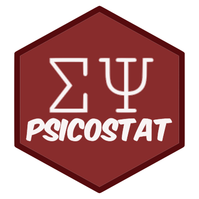
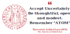

 

    

    
    

   

  We are an interdisciplinary research group interested in <b>Psychology</b> and <b>Statistics</b>, working in areas related to <b>quantitative psychology</b>, <b>psychometrics</b>, <b>psychological testing</b> and <b>statistics</b>.
  Our goal is to promote the connection between the two fields in order to benefit the progress of scientific research. We are located in the <a href="https://www.dpss.unipd.it/en/">Department of Developmental Psychology and Socialisation</a> at <a href="https://www.unipd.it/en/">University of Padua</a>.
  
   
  

  

    <h1>
    <a href="http://ip146179.psy.unipd.it/psicostat/web/">Visit our website>></a>
    </h1>
  

   
<ul>
<a class="twitter-timeline"
    href="https://twitter.com/psicostat?ref_src=twsrc%5Etfw"
    data-width="700"
    data-height="700">
    Tweets by psicostat</a>

</ul>