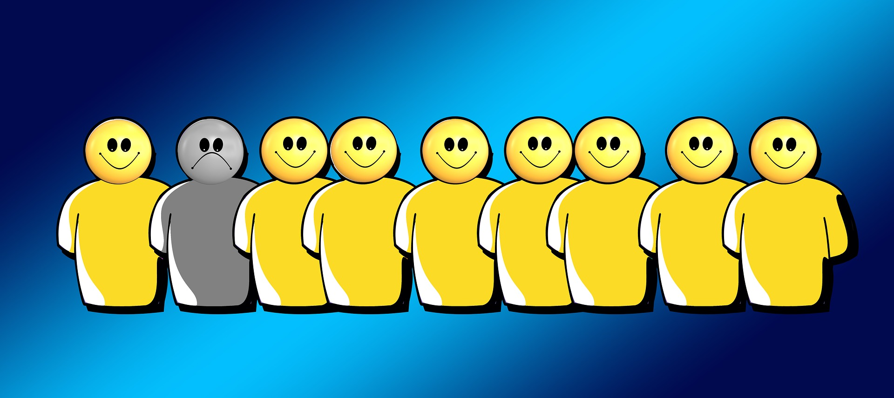
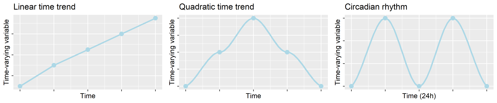

```{r setup, include=FALSE,echo=FALSE}
knitr::opts_chunk$set(collapse = TRUE)
```

***Experience Sampling Methods (ESM)*** *include a set of tools for the repeated and systematic sampling of psychological states, experiences, and activities in real time, during daily life*.

As described by [Mihaly Csikszentmihalyi](https://www.researchgate.net/profile/Mihaly-Csikszentmihalyi), one of the main ESM pioneers and developers, ESM aim at "*obtaining self-report for a representative sample of moments in people's life*" to study the **frequency, intensity and patterning** of self-reported experiences (thoughts, psychological states etc.), and daily activities (social interactions, changes in locations etc.), over time [[1]](#references).

To keep it simple, Experience Sampling means asking individuals to provide systematic self-reports by repeatedly administering **short** (e.g., max 10-20 items) and **consistent measures** (always the same questions). ESM are increasingly used in several fields of psychological research (e.g., see examples in [work](https://doi.org/10.1037/0021-9010.93.3.674), [clinical](https://doi.org/10.3389/fpsyt.2020.00214), and [personality psychology](https://doi.org/10.1073/pnas.1919934117)) due to their recognized **advantages over retrospective self-reports**.

<br>

# ESM vs. Retrospective Reports

**Retrospective self-reports** are the gold standard for measuring subjective ratings of psychological constructs, requiring respondents to rate a number of questions **referred to the past** (e.g., over the last six months, over the last year). Ratings are often given on a [Likert scale](https://methods.sagepub.com/reference/encyclopedia-of-survey-research-methods/n273.xml), with response labels being usually expressed in terms of agreement or frequency.

Here's a retrospective item often used in [workplace stress](/stress-and-workplace-stress/) research:

<iframe src="https://docs.google.com/forms/d/e/1FAIpQLSfCom9uiHbaHruWx5K1tr3j5lNgs4Lid8xQJitVoHrNs76Rxg/viewform?embedded=true" width="400" height="520" frameborder="0" marginheight="0" marginwidth="0">

Loading...</iframe>

## Recall biases

Now imagine rating the item above in the afternoon, just after an **infrequent and intense discussion with your boss**. You're probably going to overestimate the frequency of work-related interpersonal conflicts due to the **salience** (infrequent event) and **recency** (happened this morning) of this conflictual episode.


On the "cold" (cognitive) side, salience, recency, and further **recall biases** such as the [availability heuristic](https://en.wikipedia.org/wiki/Availability_heuristic) are **mental shortcuts** potentially involved each time we retrieve some information from our memory. Whether these shortcuts are necessary to provide us with adequate **cognitive efficiency** (not all information is useful), they are likely to produce systematic distortions in retrospective reports (e.g., false memories, overrating).

On the "hot" (emotional) side, **affective states** such as the momentary respondent's mood can interfere with retrieval processes as well, by driving them towards information **matching the current feeling**. For instance, the respondent might be worried or sad because of a family issue. Imagine yourself answering the following item under such a bad mood. Even if the stressor (family issue) is unrelated to your work, your rating will probably be higher than it would have been on a different day, with a different mood.

<iframe src="https://docs.google.com/forms/d/e/1FAIpQLSfh2Mad4GctaqBcja0QMqiaGYvdL7sFf6x6eQuO1AMa6rhcgw/viewform?embedded=true" width="400" height="520" frameborder="0" marginheight="0" marginwidth="0">Caricamento…</iframe>

In summary, retrospective reports are largely based on **memory retrieval**, whose accuracy is influenced by both cognitive biases (mental shortcuts) and affective states (momentary mood). In contrast, ESM are referred to the **current moment** (e.g., "*How do you feel right now?*"), minimizing memory retrieval processes, and implying less distorted data.

## Individual differences and response style

In addition to affective states, retrospective reports are also sensitive to **affective traits** and other stable **personality** characteristics such as conscientiousness, neuroticism, and hostility. 

For instance, **negative affectivity**, defined as "*a mood-dispositional dimension […] reflecting pervasive individual differences in negative emotionality and self-concept*" [[4]](#references), has been flagged as a critical confounder in workplace stress assessment. As explained in [this former post](/stress-and-workplace-stress/), stress is evaluated by measuring indicators of **stressors** (e.g., item 1: interpersonal conflict) and **strain** (e.g., item 2: perceived stress). Due to their tendency to perceive themselves and the environment as "more negative than they are", individuals with high trait negative affectivity are more likely to overrate both stressors and strain, possibly resulting in **overestimations** of the "true" relationship between the two categories of variables. 



Negative affectivity is only one of the several traits that can substantially bias self-report ratings, referred as **response styles**: the respondents' tendency to respond to survey questions in certain ways regardless of the content [[5]](#references). Although **response biases** (e.g., [social desirability](https://methods.sagepub.com/reference/encyclopedia-of-survey-research-methods/n537.xml), [halo effect](https://en.wikipedia.org/wiki/Halo_effect)) are more likely to occur under specific conditions (e.g., low motivation and/or cognitive resources available), they are strongly affected by our typical way of retrieving information, our attributional style, and our self-concept.

Whereas retrospective reports are intrinsically linked to stable individual differences, ESM are repeated over time, implying a certain amount of **variability within-individuals**, which can be quantified net of individual differences.

## Between and within individuals

With ESM data, individual differences and response styles can be controlled by [decomposing the variance into two levels](/multilevel-modeling): the **within-individual** (level 1), and the **between-individuals** level (level 2). By sampling repeated measures of the same constructs over time, ESM allow to measure intraindividual changes around the individual mean level, thus, controlling for stable individual characteristics.

Here's an example. First, we collect multiple measures of perceived stress (item 2: *Are you feeling stressed right now?*) from the same individuals over time. 


Second, we compute the **mean score for each individual**: this will be the **between-individuals component** (level 2), expressing the mean level of stress in each individual. At level 2, the variance in item scores represents individual differences around the mean score of the sample (grand average), that is it **quantifies individual differences**. This is the same information that can be estimated from retrospective reports, with the difference that ESM aggregate the scores over multiple measures, implying higher reliability than that characterizing retrospective reports (based on a single measure from each individual). Here's how it can be visualized:

```{r echo=FALSE,warning=FALSE,message=FALSE,eval=FALSE}
# simulate ESM data from 2 participants
esm <- data.frame(ID=c(rep("person1",7),rep("person2",7)),
                  Time=rep(1:7,2),
                  Stress=c(2,5,2,3,4,2,1,  6,5,6,7,4,6,6))
means <- data.frame(ID=c("person1","person2"),Stress=c(mean(esm[esm$ID=="person1","Stress"]),
                                                       mean(esm[esm$ID=="person2","Stress"])))
library(ggplot2); library(gridExtra)
p <- grid.arrange(ggplot(means,aes(x=ID,y=Stress,col=ID))+ geom_point(size=5) + scale_y_continuous(limits=c(1,7),breaks=c(1,3,5,7)) + ylab("Stress level") + xlab("") +
                 ggtitle("Retrospective reports") + theme(legend.position = "none"),
             ggplot(esm,aes(x=ID,y=Stress,col=ID))+ geom_point() + ylim(1,8) + scale_y_continuous(breaks=c(1,3,5,7)) + ylab("Stress level") + xlab("") +
                 ggtitle("ESM reports") + stat_summary(fun=mean, geom="point", size=5)  + 
                 theme(legend.position = "none"),nrow=1)
ggsave("img/esm_between_subjects.PNG",plot=p,dpi=300)
col <- c("#00BFC4","#F8766D")
p <- ggplot(esm,aes(x=Time,y=Stress,col=ID))+ ylim(1,8) + ylab("Stress level") +
    ggtitle("ESM reports within individual") + stat_summary(fun=mean, geom="point", size=5) + 
    geom_smooth(span=0.6,se=FALSE,lwd=1.2,alpha=.7) + 
    geom_hline(yintercept=means$Stress[1],color=col[2],lty=2,lwd=1.5)+
    geom_hline(yintercept=means$Stress[2],color=col[1],lty=2,lwd=1.5)+ scale_y_continuous(breaks=c(1,3,5,7)) +
    theme(legend.position="none") + geom_point()
ggsave("img/esm_within_subjects.PNG",plot=p,dpi=300)
```


Third, each single score measured from a given individual is **person-mean-centered**, that is we subtract the mean score from the single observation. This will be the **within-individual component** (level 1), expressing the momentary stress level net of the individual mean level. This component will tell us in which occasions (time points) the respondent is **more or less stressed than she usually is**, providing information on **intraindividual fluctuations**. Most importantly, this momentary stress level will be estimated by controlling for (at least part of) the individual-level differences (negative affectivity, response style, etc.) that can bias the mean stress levels. Here's how it can be visualized:


**Multilevel modeling** is better described in [this former post](/multilevel-modeling), and effectively visualized in [this beautiful tutorial](http://mfviz.com/hierarchical-models/), but the essence is the following: ESM (and repeated-measure designs in general) allow to simultaneously measure individual differences (more reliably than retrospective reports due to the repeated-measure nature of the data), and momentary deviations around the mean level, allowing to model the variability in item scores by accounting for the **hierarchical data structure** (single observations nested within individual)

## The role of the context

The **high ecological validity** (i.e., generalizability to every-day life) of ESM is somehow balanced by a **low internal validity** due to the potentially large number of confounding factors that can be encountered during daily experiences (e.g., a car accident, an unexpected news, a physical injury). The **physical and social context** is a major predictor of within-individual variability in psychological states, and a well designed ESM study should include some questions to quantify the most critical contextual confounders.

For instance, a diary study investigating the daily [effect of workplace stress on sleep quality](/sleep-stress/) might account for **stable contextual factors** unrelated to work but which can impact on both stress and sleep quality ratings, such as the number of children in the household, as well as for **transient contextual factors** such as daily family hassles (e.g., a discussion with a family member, urgent housework), leisure activities (e.g., sport, relaxation), and the daily consumption of some substances (e.g., coffee and alcohol). Critically, only stable (individual) confounders can be quantified with retrospective reports, whereas ESM potentially allow to measure both stable and transient confounders.

But the context is not just a confounder. In many ESM studies the context is the main subject under investigation, with contextual changes being used to predict changes in the psychological states measured with ESM. It is the case of **work sampling**, an technique for estimating the percentage of working time spent by employees on a range of **predefined job task categories**. By systematically measuring the type of activity undertaken and the concurrent ratings of stress, social interactions, or further variables, it is possible to identify the **job tasks perceived as more stressful**, associated with more problematic social interactions, and so on. 

The figure below shows an example from an ESM study we conducted with a sample of office workers. It can be seen that "Data analysis & Authoring" were associated with slightly higher ratings of Negative affective valence compared to "Information acquisition", whereas the opposite trend was observed for "Social activities".


## The role of time

The last and probably most important advantage of ESM over retrospective reports is the possibility to evaluate how the measured variables change and interact over time. This is very useful, for instance, in [workplace stress](/stress-and-workplace-stress/), where the **duration and frequency of exposure** to job stressors, and the associated **prolonged activation** have been identified as the key pathogenic factors. Temporal indicators (e.g., hour of the day, day number) can be directly included as a predictor of ESM ratings, to model their temporal trajectories over the data collection period. 

Time trends can be modeled in a **linear** fashion (linear increase/decrease over time) but also by accounting for **nonlinear** relationship such as a quadratic time trend (operationalized by including the square of the temporal indicator in the model). Some variables have an intrinsic **circadian rhythm**, a trend of fluctuations repeating each 24 hours that sometimes need to be statistically controlled. It is the case of perceived fatigue, which has been shown to systematically increase (both lienarly and quadratically) over the workday [[6]](#references).

```{r echo=FALSE,warning=FALSE,message=FALSE,eval=FALSE}

```
```{r , echo = FALSE, warning=FALSE,message=FALSE,eval=FALSE,fig.width=11,fig.height=2.3}
library(ggplot2); library(gridExtra)
df <- data.frame(time=1:5,
                 linear=c(1,3,4.5,6,7.5),
                 quadratic=c(1,3,5,3,1),
                 fluctuations=c(1,4,1,4,1))
p1 <- ggplot(df,aes(x=time,y=linear)) + geom_line(color="lightblue",lwd=1.2) + geom_point(color="lightblue",cex=3) +
  theme(axis.text=element_blank()) + labs(y="Time-varying variable",x="Time") + ggtitle("Linear time trend")
p2 <- ggplot(df,aes(x=time,y=quadratic)) + geom_smooth(aes(y=quadratic),col="lightblue",lwd=1.2) + ggtitle("Quadratic time trend") +
  theme(axis.text=element_blank()) + labs(y="Time-varying variable",x="Time")  + geom_point(color="lightblue",cex=3)
p3 <- ggplot(df,aes(x=time,y=fluctuations)) + geom_smooth(aes(y=fluctuations),col="lightblue",lwd=1.2) + ggtitle("Circadian rhythm") +
  theme(axis.text=element_blank()) + labs(y="Time-varying variable",x="Time (24h)")  + geom_point(color="lightblue",cex=3)
p <- grid.arrange(p1,p2,p3,nrow=1)
ggsave("img/timeTrends.PNG",plot=p,dpi=300)
```


Moreover, ESM allow to account for the **autocorrelation** between consecutive ratings, which is expected in almost any **time series** of data whatever their nature is (physiological signal, subjective ratings, frequency of behaviors, etc.). By including the autoregressive term ($Y_{T-1}$) as a model covariate, it is possible to evaluate the relationship between a time-varying predictor and a time-varying outcome **focusing on the change** in the latter from the previous measurement occasion, rather than on its absolute occasion-specific value.

Finally, ESM allow modeling **time-lagged relationships**, that is the associations between a variable measured on a given time point and another variable measured on a different time point (either before or after the former). For instance, one might investigate how job strain indicators are influenced by both the concurrent (same time point) and the preceding job stressor ratings (previous time point). Moreover, time-lagged terms are often used to model **reciprocal relationships** by two time-varying variables. It is the case of the [mutual relationship between stress and sleep](/sleep-stress/), with several diary studies highlighting a negative impact of previous-day stress on sleep and, in turn, a positive association between sleep disturbances and next-day stress ratings (e.g., [[7]](#references)).

<br>

# Planning an ESM study

At this point, you should be aware of the many advantages implicated by ESM. The main disadvantages are probably related to the complexity of the study design, implying a higher number of parameters to be considered compared to traditional (cross-sectional) studies. These include the number of measurement points and their time distance, and the training of the participants.

## Number of time points and protocol duration

The **number of time points** has important implications for the **statistical power** of the study, which is now due to both the number of participants (sample size) and the number of measurement occasions from each participant (protocol length). Although the former has a greater impact on statistical power than the latter, it is important to plan both, possibly via **multilevel power analysis** [[8]](#references). 

The number of time points and the **total duration of the protocol** also determinate the **generalizability** of the study, that is the degree of representativeness of the sampling period to the 'usual'/'normal' processes experienced in daily life. For instance a nine-day or (even better) a two-week period is the standard minimum duration used with daily diary studies, whereas research protocols that collect three or more measurements per day are often shorter. 

Indeed, further important variables affected by the number of time points are the **response rate** (% of received responses over the total number of scheduled questionnaires), and the **drop-out rate** (% of participants that interrupted their participation over the total number of recruited participants). **Missing data** and **participant burden** are crucial indicators of the quality of an ESM datasets, and both should be kept as minimum as possible (e.g., by decreasing the number of measurement points, or by including **monetary incentives** for participants that provide a minimum number of responses).

## Temporal distance and theory of change

The **temporal distance** between consecutive measurement points (which is usually related to the desired number of time points) is a further parameter to be considered. It has to do with the **theory of change** on the considered variables, that is the expected time needed to observe a substantial within-individual change in their value. Different variables take different time to fluctuate, and higher sampling frequency might result in a waste of resources. For instance, Ilies et al. [[9]](#references) used a two-week ESM design (with three measurements per day) to investigate the moderators of **interpersonal conflicts at work** (49 employees, 1,270 observations). However, the sampling protocol resulted in a mean number of reported conflicts of only 0.26 (SD = 0.26) over a five-point checklist, suggesting that the sampling frequency was to high to detect such **infrequent events**.

## Training participants

Finally, **participants training** is also very important, since it might solve potential doubts and anticipate potential problems that otherwise would occur later during the protocol. A **pilot study** involving the authors and their collaborators is always an useful choice to understand the core information to be provided during the training session. The training is also important to promote participants' compliance with the study and to reduce the drop-out rate: if participants perceive that the study is well designed, rigorous, and feasible, and if the experimenters are positively perceived, then participants will probably put more effort to adhere with the protocol.

<br>

# Conclusions

In sum, ESM overcome several limitations of retrospective reports, implying several advantages such as accounting for the role of context and time, and for both individual differences and intraindividual fluctuations. Despite the several challenges implied by ESM (e.g., missing data, participants burden, complexity of ESM designs), they are increasingly used to investigate the temporal dynamics and the interactions between time-varying constructs. [Workplace stress research](/stress-and-workplace-stress/) is particularly at the forefront of ESM application, with more and more studies providing validated ESM measures (take a look at [our study published in EJPA](future-link)!), and using ESM to investigate workpalce stress in real-time and over time.

For more information, I strongly recommend the [Open Handbook of Experience Sampling Methodology](https://www.kuleuven.be/samenwerking/real/real-book/index.htm).

<br>

# References

1.  Csikszentmihalyi, M., & Larson, R. (2014). Validity and reliability of the experience-sampling method. In *Flow and the foundations of positive psychology* (pp. 35-54). Springer, Dordrecht.

2. Lavrakas, P. J. (2008). *Encyclopedia of survey research methods* (Vols. 1-0). Thousand Oaks, CA: Sage Publications, Inc. https://doi.org/10.4135/9781412963947

3. Howard, G. S., Millham, J., Slaten, S., & O'donnell, L. (1981). Influence of subject response style effects on retrospective measures. *Applied Psychological Measurement, 5*(1), 89-100. https://doi.org/10.1177%2F014662168100500113

4. Watson, D., & Clark, L. A. (1984). Negative affectivity: The disposition to experience aversive emotional states. *Psychological Bulletin, 96*(3), 465–490. https://doi.org/10.1037/0033-2909.96.3.465

5. Van Vaerenbergh, Y., & Thomas, T. D. (2013). Response styles in survey research: A literature review of antecedents, consequences, and remedies. *International Journal of Public Opinion Research, 25*(2), 195-217. https://doi.org/10.1093/ijpor/eds021

6. Johnston, D. W., Allan, J. L., Powell, D. J., Jones, M. C., Farquharson, B., Bell, C., & Johnston, M. (2019). Why does work cause fatigue? A real-time investigation of fatigue, and determinants of fatigue in nurses working 12-hour shifts. *Annals of Behavioral Medicine, 53*(6), 551-562. https://doi.org/10.1093/abm/kay065

7. Doane, L., D., & Thurston E., C., (2014) Associations among sleep, daily experiences, and loneliness in adolescence: Evidence of moderating and bidirectional pathways. *Journal of Adolescence, 37*(2):145-154. https://doi.org/j.adolescence.2013.11.009 

8. Lafit, G., Adolf, J. K., Dejonckheere, E., Myin-Germeys, I., Viechtbauer, W., & Ceulemans, E. (2021). Selection of the number of participants in intensive longitudinal studies: A user-friendly shiny app and tutorial for performing power analysis in multilevel regression models that account for temporal dependencies. *Advances in methods and practices in psychological science, 4*(1), https://doi.org/2515245920978738