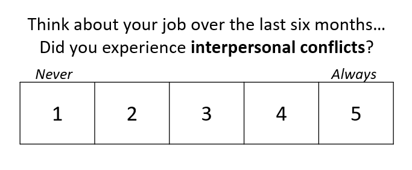
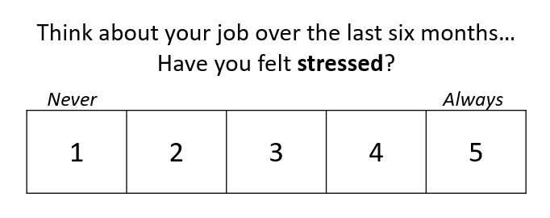

<<<<<<< HEAD
---
date: "2019-07-12"
diagram: true
image:
  placement: 3
math: true
tags: ["Experience Sampling Methods", "Ecological Momentary Assessment","Methodology","Psychometrics","Workplace stress"]
title: 'Experience Sampling Methods: Misurare le esperienze in tempo reale'
---

I ***metodi di campionamento dell'esperienza*** *includono un insieme di strumenti self-report per il campionamento ripetuto e sistematico di stati psicologici, esperienze e attività in tempo reale, nella vita di tutti i giorni*.

Come descritto da [Mihaly Csikszentmihalyi](https://www.researchgate.net/profile/Mihaly-Csikszentmihalyi), uno dei principali pionieri di questa metodologia, gli ***experience sampling methods (ESM)*** cercano di "ottenere dati auto-riferiti (*self-report*) per un campione rappresentativo dei momenti nella vita delle persone" per studiare la frequenza, l'intensità e il pattern delle esperienze riportate dall'individuo (pensieri, stati psicologici, ecc.) e delle sue attività quotidiane (interazioni sociali, cambiamenti di location, ecc.) nel corso del tempo [[1]](#references).

Per farla semplice, 'campionamento dell'esperienza' significa somministrare ripetatutamente delle misure brevi (massimo 10-20 domande) e consistenti (sempre le stesse domande). L'ESM è sempre più utilizzato in diversi campi della ricerca psicologica (ad esempio, nella [psicologia del lavoro](https://doi.org/10.1037/0021-9010.93.3.674), nella [psicologia clinica](https://doi.org/10.3389/fpsyt.2020.00214) e nella [psicologia della personalità](https://doi.org/10.1073/pnas.1919934117)) grazie ai riconosciuti vantaggi rispetto ai questionari retrospettivi.

 

## ESM vs. Questionari retrospettivi

**Retrospective reports** are the gold standard for measuring subjective ratings of psychological constructs, requiring respondents to rate a number of questions **referred to the past** (e.g., over the last six months, over the last year). Ratings are collected with a [Likert response scale](https://methods.sagepub.com/reference/encyclopedia-of-survey-research-methods/n273.xml), with response labels being usually expressed in terms of agreement or frequency. Here's a retrospective item often used in [workplace stress](/stress-and-workplace-stress/) research:

I questionari retrospettivi rappresentano il metodo gold standard per misurare valutazioni soggettive di costrutti psicologici, richiedendo ai partecipanti di valutare una serie di domande riferite al passato (ad esempio, negli ultimi sei mesi, nell'ultimo anno). Le valutazioni vengono solitamente raccolte con una scala di risposta Likert, con etichette di risposta spesso espresse in termini di accordo o frequenza. Ecco un esempio di domanda retrospettiva utilizzata nella valutazione dello stress lavorativo:

## Bias di memoria

Ora immagina di rispondere all'item sopra subito *dopo una discussione intensa e poco frequente con la/il tua/o capa/o*. Probabilmente sovrastimerai la frequenza dei conflitti interpersonali legati al lavoro a causa della **rilevanza** (evento poco frequente) e della **recenza** (è successo stamattina) di questo episodio conflittuale.

Sul "lato freddo" (cognitivo), rilevanza, recenza e ulteriori **bias di meoria** come l'[euristica della disponibilità](https://en.wikipedia.org/wiki/Availability_heuristic) sono **scorciatoie mentali** potenzialmente coinvolte ogni volta che recuperiamo informazioni dalla nostra memoria. Mentre queste sono necessarie per fornirci una corretta efficienza cognitiva (non tutte le informazioni sono utili), è probabile che producano distorsioni sistematiche nelle relazioni retrospettive (es. falsi ricordi).

Sul "lato caldo" (emozionale), **stati affettivi** come l'umore al momento della risposta possono interferire con i processi di recupero mnestico deviandoli verso **informazioni che corrispondono al sentimento attuale**. Ad esempio, il rispondente potrebbe essere preoccupato o triste a causa di una questione familiare. Immagina di rispondere all'item seguente in uno stato d'animo del genere. Anche se la fonte di stress (questioni familiari) è slegata dal lavoro, la tua valutazione sarà probabilmente più alta rispetto a come sarebbe stata in un giorno diverso, con un umore diverso.

Insomma i questionari retrospettivi (ad esempio, "*Come ti sei sentito negli ultimi mesi?*") si basano in gran parte sul **recupero mnestico**, la cui accuratezza è influenzata sia da bias cognitivi (scorciatoie mentali) che da stati affettivi (umore momentaneo). Al contrario, gli ESM si riferiscono al momento attuale (ad esempio, "*Come ti senti in questo momento?*"), minimizzando i processi di recupero di memoria e implicando dati meno distorti.

 

## Differenze individuali e stile di risposta

Oltre agli stati affettivi, le relazioni retrospettive sono sensibili anche a **tratti affettivi e ad altre caratteristiche di personalità** come coscienziosità, nevroticismo e ostilità.

Ad esempio, l'**affettività negativa**, definita come "*una disposizione dell'umore [...] che riflette le differenze individuali pervasive nell'emozionalità negatività e nel concetto di sé*" [4], è stata individuata come una variabile confondente critica nella valutazione dello stress lavorativo: persone con elevata affettività negativa tendono a fornire valutazioni più elevate sia dei fattori stressanti (*stressor*) a cui sono esposte che del proprio malessere o stress (*strain*), risultando in una sovrastima della relazione tra queste due variabili.

L'affettività negativa è solo uno dei vari tratti che possono influenzare le misure self-report, definiti come **stili di risposta**: la tendenza dei rispondenti a rispondere alle domande di un questionario in determinati modi, indipendentemente dal loro contenuto [[5]](#references). Sebbene i **bias di risposta** (ad esempio, [desiderabilità sociale](https://methods.sagepub.com/reference/encyclopedia-of-survey-research-methods/n537.xml), [effetto alone](https://en.wikipedia.org/wiki/Halo_effect)) siano più probabili in specifiche condizioni (ad esempio, bassa motivazione e/o scarse risorse cognitive), sono anche fortemente influenzati dal nostro tipico modo di recuperare informazioni, dal nostro stile di attribuzione causale e dal nostro concetto di sé.

Mentre i questionari retrospettivi sono intrinsecamente legati alle differenze individuali stabili, gli ESM sono misure ripetute nel tempo, implicando una certa quantità di **variabilità intra-individuale**, che può essere quantificata al netto delle **differenze inter-individuali**.

 

## Intra e Inter

Con il campionamento delle esperienze, le differenze individuali e gli stili di risposta possono essere controllati [scomponendo la varianza in due livelli](/multilevel-modeling): il livello **intra-individuale** (livello 1, entro l'individuo) e il livello **inter-individuale** (livello 2, tra individui). Cioè, campionando misure ripetute degli stessi costrutti nel tempo, gli ESM permettono di stimare quanto le persone possono "deviare" dai loro livelli medi.

Ecco un esempio. In primo luogo, raccogliamo misure ripetute di stress percepito dalle stesse persone nel tempo.

Secondo, calcoliamo il **punteggio medio per ogni persona**: questa sarà la **componente inter-individuale** (livello 2), che esprime il livello medio di stress in ogni persona. A livello 2, la varianza nei punteggi quantifica le **differenze individuali** all'interno del campione. Questa è la stessa informazione che può essere stimata a partire dai questionari retrospettivi, con la differenza che gli ESM aggregano i punteggi su più misure, implicando **maggiore affidabilità**. Ecco come possono essere visualizzati i punteggi inter-individuali di due persone (rosso e blu):

In terzo luogo, ogni singolo punteggio misurato da un dato individuo deve essere **centrato sulla media personale**. In altre parole, sottraiamo il punteggio medio della persona dalla singola osservazione. Questa è la **componente intra-individuale** (livello 1), che esprime il livello di stress momentaneo al netto del livello medio individuale. Questa componente ci dirà in quali occasioni (momenti temporali) il rispondente è **più o meno stressato del solito** (cioè del suo livello medio), fornendo informazioni sulle **fluttuazioni intra-individuali**. Inoltre, questo livello di stress momentaneo è stimato al netto delle differenze individuali (afettività negativa, stile di risposta, ecc.) che possono influenzare i livelli medi. Ecco come possono essere visualizzate le fluttuazioni intra-individuali (le linee continue) intorno alla media individuale (le linee tratteggiate) delle stesse due persone mostrate qui sopra:

I **modelli di regressione multilivello** sono descritti meglio [in questo precedente post](/multilevel-modeling) e in questo [bellissimo tutorial](http://mfviz.com/hierarchical-models/), ma l'essenza è la seguente: gli ESM (e le misure ripetute in generale) consentono di misurare contemporaneamente le differenze individuali (in modo più affidabile rispetto alle relazioni retrospettive a causa della natura di misurazioni ripetute dei dati) e le deviazioni momentanee intorno al livello medio, consentendo di modellare la variabilità nei dati tenendo conto della loro **struttura gerarchica** (singole osservazioni *annidate* all'interno degli individui).

 

## Il ruolo del contesto

L'**alta validità ecologica** (cioè la generalizzabilità alla vita di tutti i giorni) degli ESM è in qualche modo bilanciata da una **bassa validità interna** dovuta al numero potenzialmente elevato di fattori confondenti che possono intervenire durante le esperienze quotidiane (ad esempio, un incidente stradale, una notizia inaspettata). Il **contesto fisico e sociale** è un importante predittore della variabilità intra-individuale negli stati psicologici, e uno studio ben progettato dovrebbe sempre includere alcune domande sui fattori contestuali confondenti.

Ad esempio, uno studio di diario che indaghi l'[effetto dello stress sulla qualità del sonno](/sleep-stress/) potrebbe tenere conto di **fattori contestuali stabili** non legati al lavoro ma che possono influenzare sia le valutazioni dello stress che della qualità del sonno (ad esempio, il numero di figli piccoli), così come di **fattori contestuali transitori** come problemi personali (ad esempio, una discussione con un familiare), le attività extra-lavorative (ad esempio, sport, relax), e il consumo quotidiano di alcune sostanze (ad esempio, caffè e alcol). Va notato che soltanto le variabili contestuali 'stabili' possono essere quantificate con i questionari retrospettivi, mentre gli ESM permettono di misurare variabili confondenti sia stabili che transitorie.

Ma il contesto non è solo unna variabile confondente. In molti studi ESM, il contesto è l'oggetto principale dell'indagine: i cambiamenti contestuali vengono utilizzati per prevedere cambiamenti negli stati psicologici e nelle esperienze. È il caso del ***work sampling*** (campionamento del lavoro), una tecnica usata per stimare la proporzione di tempo lavorativo mediamente dedicata a ciasuna attività/compito. Misurando sistematicamente il tipo di attività svolta, gli stati psicologici e le esperienze, è possibile identificare i compiti lavorativi percepiti come più stressanti, quelli associati a maggiori conflitti interpersonali e così via.

La figura qui sotto mostra un esempio di uno [studio ESM che ho condotto con un campione di lavoratori d'ufficio](/experience-sampling-measurement-of-workplace-stress/). Si può vedere che compiti di "Analisi dei dati e autorship" sono stati associati a punteggi leggermente più bassi di tono d'umore rispetto a compiti di "Acquisizione di informazioni", mentre la tendenza opposta è osservabile per le "Attività sociali".

 

## Il ruolo del tempo

L'ultimo e probabilmente il più importante vantaggio degli ESM rispetto ai questionari retrospettivi è la possibilità di valutare come le variabili misurate cambiano e interagiscono nel tempo. Ciò è molto utile, ad esempio, nella [ricerca sullo stress lavorativo](/workplace-stress-and-the-management-of-psychosocial-hazards-at-work/), dove **la durata e la frequenza di esposizione** agli stressor lavorativi e la conseguente **attivazione psicofisiologica** sono stati identificati come i [principali fattori patogeni](/psychophysiology-of-the-stress-response-when-does-stress-cause-ilness/). Gli indicatori temporali (ad esempio, l'ora del giorno, il numero del giorno) possono essere inclusi direttamente come predittori delle valutazioni ESM, per modellare le loro traiettorie temporali nel periodo di raccolta dei dati. Le tendenze temporali lineari e non lineari possono essere modellate per tener conto dei ritmi circadiani intrinseci mostrati da alcune variabili come la stanchezza [[6]](#references).

Inoltre, gli ESM permettono di tenere conto dell'**autocorrelazione** tra valutazioni consecutive della stessa variabile, che è attesa in quasi ogni **serie temporale** di dati, indipendentemente dalla loro natura (segnali fisiologici, valutazioni soggettive, frequenza di comportamenti, ecc.). Includendo il termine autorregressivo ($Y_{T-1}$) come covariata di un modello, è possibile valutare la relazione tra variabili che cambiano nel tempo concentrandosi sul loro cambiamento rispetto alla misurazione precedente.

Infine, gli ESM consentono di modellare le **relazioni temporali "lagged"**, ovvero le associazioni tra una variabile misurata in un dato momento temporale e un'altra variabile misurata in un momento temporale diverso (prima o dopo). Ad esempio, si potrebbe investigare come gli indicatori dello stress lavorativo sono influenzati sia dalle valutazioni contemporanee (stesso momento) che dalle valutazioni precedenti degli stressor lavorativi (momento precedente). Inoltre, il *time lagging* ("ritardo") delle variabili è spesso utilizzato per modellare le relazioni reciproche tra due variabili variabili nel tempo (ad esempio, stress e sonno [7]](#references))).

 

## Conclusioni

Gli ESM superano diverse limitazioni dei questionari retrospettivi, comportando numerosi vantaggi come la possibilità di considerare del ruolo del contesto e del tempo, il controllo delle differenze individuali e la stima delle fluttuazioni intra-individuali. Nonostante le numerose insidie (ad esempio, dover gestire i dati mancanti, maggior sforzo richiesto ai partecipanti, complessità dei disegni di ricerca),gli ESM vengono sempre più utilizzati per studiare le dinamiche temporali e le interazioni tra costrutti che variano nel tempo. La ricerca sullo stress lavorativo è particolarmente all'avanguardia nell'applicazione dell'ESM, con un numero crescente di studi che forniscono misure validate e le utilizzano per indagare lo stress sul lavoro in tempo reale, come il [nostro studio recentemente pubblicato sullo European Journal of Psychological Assessment](/2021_Menghini_ESM_workplace_stress/).

Per ulteriori informazioni su questa metodologia di ricerca, consiglio vivamente l'[Open Handbook of Experience Sampling Methodology](https://www.kuleuven.be/samenwerking/real/real-book/index.htm).

 

# Riferimenti

1.  Csikszentmihalyi, M., & Larson, R. (2014). Validity and reliability of the experience-sampling method. In *Flow and the foundations of positive psychology* (pp. 35-54). Springer, Dordrecht.

2. Lavrakas, P. J. (2008). *Encyclopedia of survey research methods* (Vols. 1-0). Thousand Oaks, CA: Sage Publications, Inc. https://doi.org/10.4135/9781412963947

3. Howard, G. S., Millham, J., Slaten, S., & O'donnell, L. (1981). Influence of subject response style effects on retrospective measures. *Applied Psychological Measurement, 5*(1), 89-100. https://doi.org/10.1177%2F014662168100500113

4. Watson, D., & Clark, L. A. (1984). Negative affectivity: The disposition to experience aversive emotional states. *Psychological Bulletin, 96*(3), 465–490. https://doi.org/10.1037/0033-2909.96.3.465

5. Van Vaerenbergh, Y., & Thomas, T. D. (2013). Response styles in survey research: A literature review of antecedents, consequences, and remedies. *International Journal of Public Opinion Research, 25*(2), 195-217. https://doi.org/10.1093/ijpor/eds021

6. Johnston, D. W., Allan, J. L., Powell, D. J., Jones, M. C., Farquharson, B., Bell, C., & Johnston, M. (2019). Why does work cause fatigue? A real-time investigation of fatigue, and determinants of fatigue in nurses working 12-hour shifts. *Annals of Behavioral Medicine, 53*(6), 551-562. https://doi.org/10.1093/abm/kay065

7. Doane, L., D., & Thurston E., C., (2014) Associations among sleep, daily experiences, and loneliness in adolescence: Evidence of moderating and bidirectional pathways. *Journal of Adolescence, 37*(2):145-154. https://doi.org/j.adolescence.2013.11.009 
=======
---
date: "2019-07-12"
diagram: true
image:
  placement: 3
math: true
tags: ["Experience Sampling Methods", "Ecological Momentary Assessment","Methodology","Psychometrics","Workplace stress"]
title: 'Experience Sampling Methods: Misurare le esperienze in tempo reale'
---

I ***metodi di campionamento dell'esperienza*** *includono un insieme di strumenti self-report per il campionamento ripetuto e sistematico di stati psicologici, esperienze e attività in tempo reale, nella vita di tutti i giorni*.

Come descritto da [Mihaly Csikszentmihalyi](https://www.researchgate.net/profile/Mihaly-Csikszentmihalyi), uno dei principali pionieri di questa metodologia, gli ***experience sampling methods (ESM)*** cercano di "ottenere dati auto-riferiti (*self-report*) per un campione rappresentativo dei momenti nella vita delle persone" per studiare la frequenza, l'intensità e il pattern delle esperienze riportate dall'individuo (pensieri, stati psicologici, ecc.) e delle sue attività quotidiane (interazioni sociali, cambiamenti di location, ecc.) nel corso del tempo [[1]](#references).

Per farla semplice, 'campionamento dell'esperienza' significa somministrare ripetatutamente delle misure brevi (massimo 10-20 domande) e consistenti (sempre le stesse domande). L'ESM è sempre più utilizzato in diversi campi della ricerca psicologica (ad esempio, nella [psicologia del lavoro](https://doi.org/10.1037/0021-9010.93.3.674), nella [psicologia clinica](https://doi.org/10.3389/fpsyt.2020.00214) e nella [psicologia della personalità](https://doi.org/10.1073/pnas.1919934117)) grazie ai riconosciuti vantaggi rispetto ai questionari retrospettivi.

 

## ESM vs. Questionari retrospettivi

**Retrospective reports** are the gold standard for measuring subjective ratings of psychological constructs, requiring respondents to rate a number of questions **referred to the past** (e.g., over the last six months, over the last year). Ratings are collected with a [Likert response scale](https://methods.sagepub.com/reference/encyclopedia-of-survey-research-methods/n273.xml), with response labels being usually expressed in terms of agreement or frequency. Here's a retrospective item often used in [workplace stress](/stress-and-workplace-stress/) research:

I questionari retrospettivi rappresentano il metodo gold standard per misurare valutazioni soggettive di costrutti psicologici, richiedendo ai partecipanti di valutare una serie di domande riferite al passato (ad esempio, negli ultimi sei mesi, nell'ultimo anno). Le valutazioni vengono solitamente raccolte con una scala di risposta Likert, con etichette di risposta spesso espresse in termini di accordo o frequenza. Ecco un esempio di domanda retrospettiva utilizzata nella valutazione dello stress lavorativo:

## Bias di memoria

Ora immagina di rispondere all'item sopra subito *dopo una discussione intensa e poco frequente con la/il tua/o capa/o*. Probabilmente sovrastimerai la frequenza dei conflitti interpersonali legati al lavoro a causa della **rilevanza** (evento poco frequente) e della **recenza** (è successo stamattina) di questo episodio conflittuale.

Sul "lato freddo" (cognitivo), rilevanza, recenza e ulteriori **bias di meoria** come l'[euristica della disponibilità](https://en.wikipedia.org/wiki/Availability_heuristic) sono **scorciatoie mentali** potenzialmente coinvolte ogni volta che recuperiamo informazioni dalla nostra memoria. Mentre queste sono necessarie per fornirci una corretta efficienza cognitiva (non tutte le informazioni sono utili), è probabile che producano distorsioni sistematiche nelle relazioni retrospettive (es. falsi ricordi).

Sul "lato caldo" (emozionale), **stati affettivi** come l'umore al momento della risposta possono interferire con i processi di recupero mnestico deviandoli verso **informazioni che corrispondono al sentimento attuale**. Ad esempio, il rispondente potrebbe essere preoccupato o triste a causa di una questione familiare. Immagina di rispondere all'item seguente in uno stato d'animo del genere. Anche se la fonte di stress (questioni familiari) è slegata dal lavoro, la tua valutazione sarà probabilmente più alta rispetto a come sarebbe stata in un giorno diverso, con un umore diverso.

Insomma i questionari retrospettivi (ad esempio, "*Come ti sei sentito negli ultimi mesi?*") si basano in gran parte sul **recupero mnestico**, la cui accuratezza è influenzata sia da bias cognitivi (scorciatoie mentali) che da stati affettivi (umore momentaneo). Al contrario, gli ESM si riferiscono al momento attuale (ad esempio, "*Come ti senti in questo momento?*"), minimizzando i processi di recupero di memoria e implicando dati meno distorti.

 

## Differenze individuali e stile di risposta

Oltre agli stati affettivi, le relazioni retrospettive sono sensibili anche a **tratti affettivi e ad altre caratteristiche di personalità** come coscienziosità, nevroticismo e ostilità.

Ad esempio, l'**affettività negativa**, definita come "*una disposizione dell'umore [...] che riflette le differenze individuali pervasive nell'emozionalità negatività e nel concetto di sé*" [4], è stata individuata come una variabile confondente critica nella valutazione dello stress lavorativo: persone con elevata affettività negativa tendono a fornire valutazioni più elevate sia dei fattori stressanti (*stressor*) a cui sono esposte che del proprio malessere o stress (*strain*), risultando in una sovrastima della relazione tra queste due variabili.

L'affettività negativa è solo uno dei vari tratti che possono influenzare le misure self-report, definiti come **stili di risposta**: la tendenza dei rispondenti a rispondere alle domande di un questionario in determinati modi, indipendentemente dal loro contenuto [[5]](#references). Sebbene i **bias di risposta** (ad esempio, [desiderabilità sociale](https://methods.sagepub.com/reference/encyclopedia-of-survey-research-methods/n537.xml), [effetto alone](https://en.wikipedia.org/wiki/Halo_effect)) siano più probabili in specifiche condizioni (ad esempio, bassa motivazione e/o scarse risorse cognitive), sono anche fortemente influenzati dal nostro tipico modo di recuperare informazioni, dal nostro stile di attribuzione causale e dal nostro concetto di sé.

Mentre i questionari retrospettivi sono intrinsecamente legati alle differenze individuali stabili, gli ESM sono misure ripetute nel tempo, implicando una certa quantità di **variabilità intra-individuale**, che può essere quantificata al netto delle **differenze inter-individuali**.

 

## Intra e Inter

Con il campionamento delle esperienze, le differenze individuali e gli stili di risposta possono essere controllati [scomponendo la varianza in due livelli](/multilevel-modeling): il livello **intra-individuale** (livello 1, entro l'individuo) e il livello **inter-individuale** (livello 2, tra individui). Cioè, campionando misure ripetute degli stessi costrutti nel tempo, gli ESM permettono di stimare quanto le persone possono "deviare" dai loro livelli medi.

Ecco un esempio. In primo luogo, raccogliamo misure ripetute di stress percepito dalle stesse persone nel tempo.

Secondo, calcoliamo il **punteggio medio per ogni persona**: questa sarà la **componente inter-individuale** (livello 2), che esprime il livello medio di stress in ogni persona. A livello 2, la varianza nei punteggi quantifica le **differenze individuali** all'interno del campione. Questa è la stessa informazione che può essere stimata a partire dai questionari retrospettivi, con la differenza che gli ESM aggregano i punteggi su più misure, implicando **maggiore affidabilità**. Ecco come possono essere visualizzati i punteggi inter-individuali di due persone (rosso e blu):

In terzo luogo, ogni singolo punteggio misurato da un dato individuo deve essere **centrato sulla media personale**. In altre parole, sottraiamo il punteggio medio della persona dalla singola osservazione. Questa è la **componente intra-individuale** (livello 1), che esprime il livello di stress momentaneo al netto del livello medio individuale. Questa componente ci dirà in quali occasioni (momenti temporali) il rispondente è **più o meno stressato del solito** (cioè del suo livello medio), fornendo informazioni sulle **fluttuazioni intra-individuali**. Inoltre, questo livello di stress momentaneo è stimato al netto delle differenze individuali (afettività negativa, stile di risposta, ecc.) che possono influenzare i livelli medi. Ecco come possono essere visualizzate le fluttuazioni intra-individuali (le linee continue) intorno alla media individuale (le linee tratteggiate) delle stesse due persone mostrate qui sopra:

I **modelli di regressione multilivello** sono descritti meglio [in questo precedente post](/multilevel-modeling) e in questo [bellissimo tutorial](http://mfviz.com/hierarchical-models/), ma l'essenza è la seguente: gli ESM (e le misure ripetute in generale) consentono di misurare contemporaneamente le differenze individuali (in modo più affidabile rispetto alle relazioni retrospettive a causa della natura di misurazioni ripetute dei dati) e le deviazioni momentanee intorno al livello medio, consentendo di modellare la variabilità nei dati tenendo conto della loro **struttura gerarchica** (singole osservazioni *annidate* all'interno degli individui).

 

## Il ruolo del contesto

L'**alta validità ecologica** (cioè la generalizzabilità alla vita di tutti i giorni) degli ESM è in qualche modo bilanciata da una **bassa validità interna** dovuta al numero potenzialmente elevato di fattori confondenti che possono intervenire durante le esperienze quotidiane (ad esempio, un incidente stradale, una notizia inaspettata). Il **contesto fisico e sociale** è un importante predittore della variabilità intra-individuale negli stati psicologici, e uno studio ben progettato dovrebbe sempre includere alcune domande sui fattori contestuali confondenti.

Ad esempio, uno studio di diario che indaghi l'[effetto dello stress sulla qualità del sonno](/sleep-stress/) potrebbe tenere conto di **fattori contestuali stabili** non legati al lavoro ma che possono influenzare sia le valutazioni dello stress che della qualità del sonno (ad esempio, il numero di figli piccoli), così come di **fattori contestuali transitori** come problemi personali (ad esempio, una discussione con un familiare), le attività extra-lavorative (ad esempio, sport, relax), e il consumo quotidiano di alcune sostanze (ad esempio, caffè e alcol). Va notato che soltanto le variabili contestuali 'stabili' possono essere quantificate con i questionari retrospettivi, mentre gli ESM permettono di misurare variabili confondenti sia stabili che transitorie.

Ma il contesto non è solo unna variabile confondente. In molti studi ESM, il contesto è l'oggetto principale dell'indagine: i cambiamenti contestuali vengono utilizzati per prevedere cambiamenti negli stati psicologici e nelle esperienze. È il caso del ***work sampling*** (campionamento del lavoro), una tecnica usata per stimare la proporzione di tempo lavorativo mediamente dedicata a ciasuna attività/compito. Misurando sistematicamente il tipo di attività svolta, gli stati psicologici e le esperienze, è possibile identificare i compiti lavorativi percepiti come più stressanti, quelli associati a maggiori conflitti interpersonali e così via.

La figura qui sotto mostra un esempio di uno [studio ESM che ho condotto con un campione di lavoratori d'ufficio](/experience-sampling-measurement-of-workplace-stress/). Si può vedere che compiti di "Analisi dei dati e autorship" sono stati associati a punteggi leggermente più bassi di tono d'umore rispetto a compiti di "Acquisizione di informazioni", mentre la tendenza opposta è osservabile per le "Attività sociali".

 

## Il ruolo del tempo

L'ultimo e probabilmente il più importante vantaggio degli ESM rispetto ai questionari retrospettivi è la possibilità di valutare come le variabili misurate cambiano e interagiscono nel tempo. Ciò è molto utile, ad esempio, nella [ricerca sullo stress lavorativo](/workplace-stress-and-the-management-of-psychosocial-hazards-at-work/), dove **la durata e la frequenza di esposizione** agli stressor lavorativi e la conseguente **attivazione psicofisiologica** sono stati identificati come i [principali fattori patogeni](/psychophysiology-of-the-stress-response-when-does-stress-cause-ilness/). Gli indicatori temporali (ad esempio, l'ora del giorno, il numero del giorno) possono essere inclusi direttamente come predittori delle valutazioni ESM, per modellare le loro traiettorie temporali nel periodo di raccolta dei dati. Le tendenze temporali lineari e non lineari possono essere modellate per tener conto dei ritmi circadiani intrinseci mostrati da alcune variabili come la stanchezza [[6]](#references).

Inoltre, gli ESM permettono di tenere conto dell'**autocorrelazione** tra valutazioni consecutive della stessa variabile, che è attesa in quasi ogni **serie temporale** di dati, indipendentemente dalla loro natura (segnali fisiologici, valutazioni soggettive, frequenza di comportamenti, ecc.). Includendo il termine autorregressivo ($Y_{T-1}$) come covariata di un modello, è possibile valutare la relazione tra variabili che cambiano nel tempo concentrandosi sul loro cambiamento rispetto alla misurazione precedente.

Infine, gli ESM consentono di modellare le **relazioni temporali "lagged"**, ovvero le associazioni tra una variabile misurata in un dato momento temporale e un'altra variabile misurata in un momento temporale diverso (prima o dopo). Ad esempio, si potrebbe investigare come gli indicatori dello stress lavorativo sono influenzati sia dalle valutazioni contemporanee (stesso momento) che dalle valutazioni precedenti degli stressor lavorativi (momento precedente). Inoltre, il *time lagging* ("ritardo") delle variabili è spesso utilizzato per modellare le relazioni reciproche tra due variabili variabili nel tempo (ad esempio, stress e sonno [7]](#references))).

 

## Conclusioni

Gli ESM superano diverse limitazioni dei questionari retrospettivi, comportando numerosi vantaggi come la possibilità di considerare del ruolo del contesto e del tempo, il controllo delle differenze individuali e la stima delle fluttuazioni intra-individuali. Nonostante le numerose insidie (ad esempio, dover gestire i dati mancanti, maggior sforzo richiesto ai partecipanti, complessità dei disegni di ricerca),gli ESM vengono sempre più utilizzati per studiare le dinamiche temporali e le interazioni tra costrutti che variano nel tempo. La ricerca sullo stress lavorativo è particolarmente all'avanguardia nell'applicazione dell'ESM, con un numero crescente di studi che forniscono misure validate e le utilizzano per indagare lo stress sul lavoro in tempo reale, come il [nostro studio recentemente pubblicato sullo European Journal of Psychological Assessment](/2021_Menghini_ESM_workplace_stress/).

Per ulteriori informazioni su questa metodologia di ricerca, consiglio vivamente l'[Open Handbook of Experience Sampling Methodology](https://www.kuleuven.be/samenwerking/real/real-book/index.htm).

 

# Riferimenti

1.  Csikszentmihalyi, M., & Larson, R. (2014). Validity and reliability of the experience-sampling method. In *Flow and the foundations of positive psychology* (pp. 35-54). Springer, Dordrecht.

2. Lavrakas, P. J. (2008). *Encyclopedia of survey research methods* (Vols. 1-0). Thousand Oaks, CA: Sage Publications, Inc. https://doi.org/10.4135/9781412963947

3. Howard, G. S., Millham, J., Slaten, S., & O'donnell, L. (1981). Influence of subject response style effects on retrospective measures. *Applied Psychological Measurement, 5*(1), 89-100. https://doi.org/10.1177%2F014662168100500113

4. Watson, D., & Clark, L. A. (1984). Negative affectivity: The disposition to experience aversive emotional states. *Psychological Bulletin, 96*(3), 465–490. https://doi.org/10.1037/0033-2909.96.3.465

5. Van Vaerenbergh, Y., & Thomas, T. D. (2013). Response styles in survey research: A literature review of antecedents, consequences, and remedies. *International Journal of Public Opinion Research, 25*(2), 195-217. https://doi.org/10.1093/ijpor/eds021

6. Johnston, D. W., Allan, J. L., Powell, D. J., Jones, M. C., Farquharson, B., Bell, C., & Johnston, M. (2019). Why does work cause fatigue? A real-time investigation of fatigue, and determinants of fatigue in nurses working 12-hour shifts. *Annals of Behavioral Medicine, 53*(6), 551-562. https://doi.org/10.1093/abm/kay065

7. Doane, L., D., & Thurston E., C., (2014) Associations among sleep, daily experiences, and loneliness in adolescence: Evidence of moderating and bidirectional pathways. *Journal of Adolescence, 37*(2):145-154. https://doi.org/j.adolescence.2013.11.009
