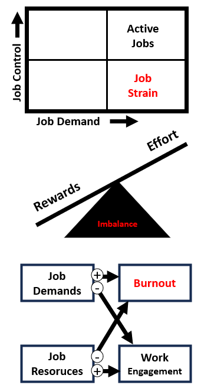

```{r setup, include=FALSE,echo=FALSE}
knitr::opts_chunk$set(collapse = TRUE)
```

_Lo **stress lavoro-correlato** è un fenomeno molto diffuso e anche molto costoso per le persone, le organizzazioni e la società in generale. Negli ultimi anni, la ricerca scientifica ha permesso di caratterizzare sempre meglio **la risposta da stress** a livello fisiologico e psicologico. Questo ha permesso di formulare modelli teorici consolidati dello stress lavoro-correlato, quadri normativi e buone pratiche per assistere le organizzazioni nell'identificare, valutare e gestire i **rischi psicosociali**. Come possiamo ridurre lo stress sul lavoro?_

<br>

# Che cos'è lo stress?

[Come discusso in questo post](/it/psicofisiologia-della-risposta-da-stress-come-fa-lo-stress-a-farci-ammalare/), lo stress è un fenomeno complesso e multisfaccettato che coinvolge diversi processi indagati da discipline diverse (es. fisica, biologia, medicina, psicologia). A sua volta, lo stress è influenzato da fattori di varia natura (es. biochimici, genetici, psico-sociali) con un decorso **transitorio** (es. un esame, un colloquio di lavoro), **cronico** (es. una guerra, una disabilità permanente) o addirittura **disposizionale** (es. disturbi d'ansia).

Nonostante la sua complessità, abbiamo ormai raggiunto una comprensione avanzata dei meccanismi e delle condizioni che possono portare dall'esposizione ad uno ***stressor*** (cioè un fattore ambientale stressante) a reazioni di ***strain***, cioè le risposte psicofisiologiche allo stress (dall'inglese "*strain*" = "tensione", "sforzo", "tirare", "forzare"). Sappiamo ad esempio che **la risposta da stress è aspecifica**, cioè che si manifesta con sintomi simili in risposta a stimoli molto diversi (es. *stressor* fisici, cognitivi o emotivi), ma allo stesso tempo **persone diverse rispondono in modo diverso** alla stessa fonte di stress. 

Basti pensare a **due lavoratrici con diversa anzianità lavorativa** che svolgono la stessa mansione: una neoassunta e l'altra che fa quel lavoro da 20 anni. Di fronte allo stesso carico di lavoro, la lavoratrice più anziana si sentirà meno stressata poiché ormai abituata al tipo di attività previste per quella mansione. Dal canto suo, la neoassunta, essendo più giovane, potrebbe avere più risorse a disposizione (es. resistenza, flessibilità) per gestire il carico di lavoro.

{width=60%}

Le **differenze individuali** come l'anzianità lavorativa e molte altre (es. genere, personalità, status socioeconomico, netowrk di relazioni) esercitano una forte influenza sui processi di **valutazione cognitiva** (*cognitive appraisal*) che si attivano quando ci troviamo di fronte ad uno stimolo o una condizione potenzialmente stressante. Secondo le teorie psicologiche più supportate, l'esito di queste valutazioni spesso determina il modo in cui rispondiamo agli *stressor*, come l'intensità e la durata delle nostre risposte da stress e la probabilità che queste assumano un carattere **cronico**, sfociando in condizioni di malattia.

È ormai risaputo che lo stress di per sé non fa male. Anzi, **lo stress nel breve termine è positivo** perché permette di affrontare la nostra giornata e tutte le possibili insidie, sfide e minacce che possiamo incontrare. Senza stress non potremmo vivere (o comunque saremmo in una specie di coma). Ma **quando lo stress diventa cronico**, cioè protratto nel tempo (anche in quei momenti in cui avremmo [bisogno di recuperare](/it/sonno-rilassamento-e-recupero-perche-il-tempo-libero-e-cosi-importante/)), ecco che aumenta la probabilità di sviluppare disturbi metabolici, cardiovascolari, gastrointestinali, fino alla morte.

[Hli effetti dello stress sulla salute sono discussi qui](/it/psicofisiologia-della-risposta-da-stress-come-fa-lo-stress-a-farci-ammalare/), mentre questo post si concentra su un tipo particolare di stress, forse il più frequente, cioè lo **stress lavoro-correlato**. Che cos'è lo stress lavoro correlato? Quali sono le sue cause? E come possono essere valutate e gestite per ridurre i livelli di stress?

<br>

# Stress lavoro-correlato

Lo stress può generare potenzialmente da qualsiasi attività. Ma al giorno d'oggi, se dovessimo intervistare un individuo adulto a caso chiedendo un'esempio di attività stressante, la risposta più probabile sarebbe **il lavoro**. Il lavoro è l'Attività per eccellenza. Putroppo o per fortuna (io dico purtrppo), la nostra vita, le nostre relazioni sociali e perfino i nostri [ritmi circadiani](/it/sonno-rilassamento-e-recupero-perche-il-tempo-libero-e-cosi-importante/) sono profondamente influenzati dal nostro orario di lavoro. La maggior parte delle nostre risorse metaboliche, psicologiche e sociali sono dirette alle attività lavorative, mentre il termine "**tempo libero**" è usato sia come sinonimo di "recupero" che come contrario di "lavoro".

Lo **stress lavoro-correlato** è lo stress *causato* dalla condizione di lavorare e potenzialmente da tutti quei **fattori psico-sociali** che caratterizzano il contenuto e il contesto di lavoro, dai rapporti con colleghə e supervisor ai carichi e ritmi di lavoro. 

Una definizione più puntuale è quella della [International Labour Organization (ILO)](https://www.ilo.org/wcmsp5/groups/public/---ed_protect/---protrav/---safework/documents/publication/wcms_466547.pdf), che definisce lo stress come «*la risposta fisica ed emozionale causata dallo* ***squilibrio*** *percepito dall’individuo tra le* ***domande*** *lavorative e le proprie* ***risorse*** *e abilità […] determinata dall’organizzazione del lavoro, dalla sua progettazione e dalle relazioni lavorative*». Analogamente, l'[Accordo Quadro Europeo del 2004 sullo stress lavoro-correlato](https://www.inail.it/cs/internet/docs/stress-lavoro-accordo-interconfederale_6443111488618.pdf?section=attivita) lo definisce come «*una condizione che può essere accompagnata da disturbi o disfunzioni di natura fisica, psicologica o sociale […] conseguenza del fatto che alcuni individui non si sentono in grado di rispondere alle* ***richieste*** *o alle* ***aspettative*** *riposte in loro*».


Da una parte, lo stress è quindi dovuto alla **progettazione del lavoro** (cioè una responsabilità dell'organizzazione e del datore di lavoro). Dall'altra, esso è anche influenzato da molteplici **processi psicosociali** che caratterizzano il modo in cui le persone tendono a valutare il proprio ambiente, le richieste e le aspettative legate al lavoro e le proprie capacità e risorse. Ma come prevenire, gestire e/o ridurre lo stress lavoro-correlato? Per rispondere a questa domanda dobbiamo capire quali sono **le principali cause (*****stressor*****) e conseguenze (*****strain*****) di questo fenomeno**.

<br>

## Le cause dello stress: pericoli e rischi psicosociali

Nell'ambito della salute e sicurezza sul lavoro, le potenziali cause dello stress lavoro-correlato (***job stressor***) vengono più comunemente indicate con il termine "**rischi psicosociali**”, per analogia con i "**rischi tradizionali**" di tipo "fisico". Questi ultimi, come ad esempio il rumore, la temperatura e l'esposizione ad agenti chimici, sono infatti considerati da più tempo ([ma non da chissà quando](https://it.wikipedia.org/wiki/Salute_e_sicurezza_sul_lavoro#Storia)) come dei fattori da gestire in modo prioritario al fine di prevenire gli **infortuni sul lavoro** e le **malattie professionali**. Sebbene [le caratteristiche fisiche del luogo di lavoro siano anch'esse legate al benessere psicologico](/it/caratteristiche-fisiche-del-luogo-di-lavoro-e-benessere-lavorativo/), le loro conseguenze a livello "fisico" o "medico" sono spesso considerate più prioritarie di quelle legate alla salute mentale e al benessere psicologico.

<br>

# 🛠️⛑️🧯☠️ &rightarrow; 🧑📅🤝⏱️

Entrambi i fattori di rischio ("tradizionali" e psicosociali) si rifanno ai concetti fondamentali di *pericolo* e *rischio*. I **pericoli psicosociali** (*psychosocial hazards*) sono definiti come «*quegli aspetti di progettazione, di organizzazione e gestione del lavoro, nonché i rispettivi contesti ambientali e sociali, che possono potenzialmente arrecare danni fisici o psicologici*» [[1]](#references). Ad esempio, comuni pericoli psicosociali legati al **contenuto del lavoro** includono la *pianificazione dei compiti*, il *carico e ritmo di lavoro* e l'*orario lavorativo*, mentre i pericoli legati al **contesto del lavoro** includono ad esempio i *rapporti interpersonali*, l'*autonomia decisionale* e l'*interfaccia casa-lavoro*.

I **rischi psicosociali** hanno invece una definizione più incerta.  Il *rischio* ($R$) è generalmente definito come il prodotto $R = P \times G$ tra la probabilità $P$ che venga raggiunto il livello potenziale di danno e la gravità $G$ del danno stesso. Tuttavia, quando riferita ad un pericolo psicosociale, la stima di $P$ e $G$ è difficile da determinare, a causa dei molti fattori che possono intervenire nella **valutazione soggettiva** del pericolo stesso (es. frequenza di esposizione ad elevato carico di lavoro) e nella conseguente **risposta individuale** (es. strategie personali per gestire un aumento nel carico di lavoro). La valutazione soggettiva è infatti un fattore determinante per l'intensità e la durata della [risposta da stress](/it/psicofisiologia-della-risposta-da-stress-come-fa-lo-stress-a-farci-ammalare/). Come vedremo, questo rende la valutazione dei rischi psicosociali un processo per niente banale, che non può essere affrontato con la (relativa) semplicità che caratterizza i rischi "tradizionali".

Prima ancora di valutarne i rischi associati, risulta **complicato individuare i pericoli psicosociali**. Mentre esistono delle *tassonomie* condivise che raccolgono i principali pericoli fisici associati a diversi gruppi occupazionali (ad es. nel settore metalmeccanico vanno considerati specifici fattori, diversi da quelli del settore sanitario), lo stress lavoro-correlato «*può potenzialmente colpire* ***qualsiasi posto di lavoro e qualunque lavoratore****, indipendentemente dalla grandezza dell'impresa, dal settore di attività o dal tipo di relazione contrattuale o di lavoro*» (Accordo Europeo del 2004). Sebbene la ricerca in psicologia stia fornendo evidenze sempre più solide sui **pericoli psicosociali occupazione-specifici** (ad es., [in questo studio abbiamo valutato alcuni indicatori contestualizzati nel settore sanitario](/publication/2021_menghini_balducci_contextualized_indicators_workplacestress/)), siamo ancora lontani dal disporre di tassonomie come quelle che abbiamo per i pericoli "tradizionali."

<br>

## Le teorie sullo stress lavoro-correlato: quali pericoli psicosociali dobbiamo considerare?

Per sopperire all'incerta identificazione dei pericoli psicosociali, sono stati proposti diversi modelli teorici che suggeriscono le principali dimensioni su cui valutare il carattere stressante di un lavoro. Tra questi troviamo, ad esempio, il **Modello Domanda-Controllo** [[2]](#references) che identifica le mansioni ad alto carico di lavoro (*job demand*) e bassa autonomia decisionale (*job control*) come quelle più stressanti. Un altro approccio condiviso è quello del **Modello Sforzo-Ricompensa** [[3]](#references), per cui lo stress sarebbe generato da uno sbilanciamento tra gli *sforzi lavorativi* percepiti dall'individuo (l'energia che investiamo sul lavoro) e le *ricompense* tangibili (es. stipendio) e intangibili (es. stima, relazioni, sicurezza lavorativa) che riceviamo in cambio. Infine, va menzionato il celebre **Modello Domande-Risorse** [[4]](#references), secondo il quale le caratteristiche del lavoro sono fondamentalmente raggruppabili in richieste poste all'individuo (*domande lavorative*) e fattori protettivi (*risorse lavorative*). Mentre le prime comportano un maggiore rischio di stress e burnout, le seconde riducono questo rischio e promuovono la motivazione (*job engagement*).



<br>

## Le conseguenze e i costi dello stress

Quasi indipendentemente dal modello teorico adottato, la letteratura scientifica ha negli anni fornito numerose e consistenti evidenze circa le conseguenze dello stress per l'individuo, per le organizzazioni e per la società nel suo complesso. Senza pretese di esaustività, vediamo quali sono le principali **cateogorie di costo**, in modo da essere più consapevolə dei molti benefici derivabili da una rigorosa gestione dei rischi psicosociali.

A livello individuale, i costi dello stress sono principalmente riferiti alle spese sanitarie per fronteggiare le sue **conseguenze sulla salute** (es. disturbi cardiovascolari, metabolici, gastrointestinali, muscoloscheletrici e disturbi mentali). Ai **costi tangibili** dello stress (es. visite mediche, farmaci e cure ospedaliere) vanno aggiunte la perdita del reddito durante le assenze dal lavoro e le spese sostenute da amicə e familiari. Infine, non sono da sottovalutare i **costi intangibili** sostenuti dall’individuo, i “*costi umani*” dello stress come il dolore, la paura e una ridotta qualità della vita, l'impoverimento nelle relazioni sociali e la minore soddisfazione lavorativa.

A livello organizzativo, i costi dello stress sono legati ai **giorni di assenza**, ai casi di licenziamento e pensionamento prematuro, con conseguente aumento dei costi legati al **turnover** (reclutamento, formazione e sviluppo di nuovo personale), i costi legati a reclami, contenziosi e richieste di indennizzo, ai danni alle attrezzature dovuti ad un maggior numero di **incidenti ed errori**, nonché alla **perdita di produttività** e ai danni all’immagine pubblica e alla reputazione dell’azienda. Sebbene la quantificazione di questi costi per la singola azienda sia un'impresa ardua, un lavoro commissionato nel 2013 dalla [Executive Agency for Health and Consumers](https://eur-lex.europa.eu/EN/legal-content/summary/executive-agency-for-health-and-consumers.html) ha stimato **un guadagno fino a 13.62 euro per ogni euro speso** in programmi di prevenzione dei disturbi mentali e di promozione della salute mentale sul lavoro [[5]](#references).

Infine, a livello sociale, i costi dello stress sono principalmente riferiti ai **costi sanitari** e al **calo di produttività** (es. numero di giornate lavorativi "persi" a causa dello stress). Ad esempio, la [European Commission for Employement and Social Affairs]((https://eur-lex.europa.eu/resource.html?uri=cellar:9f53b8c2-75a1-404a-851f-65d4b826d528.0005.02/DOC_2&format=PDF) ha stimato alla fine degli anni '90 che lo stress contribuiva ad almeno il 10% dei costi pubblici derivanti da problemi di salute e sicurezza sul lavoro, corrispondente ad un costo complessivo per l'Unione Europea di circa **20 miliardi di euro all'anno** [[7]](#references). Più recentemente, una revisione sistematica degli [studi '*cost-of-illness*'](https://www.ncbi.nlm.nih.gov/pmc/articles/PMC4278062/#:~:text=Cost%20of%20illness%20(COI)%2C,%2C%20communities%2C%20and%20even%20individuals.) condotti in Australia, Canada, Svizzera, UK e diversi paesi dell'EU ha stimato un costo medio per paese **tra 221.13 milioni e 187 miliardi di dollari l'anno**, per lo più dovuti al calo di produttività (70-90%) e ai costi santiari (10-30%) [[6]](#references).

Insomma lo stress costa caro a tuttə. Ed è nell'interesse di tutte le parti coinvolte cercare di prevenirlo e gestirlo al meglio.

<br>

# Come gestire i rischi psicosociali sul lavoro?

Come dicevamo, i **rischi psicosociali** sono molto diversi dai rischi "tradizionali" per la salute e la sicurezza sul lavoro. Abbiamo detto che la probabilità $P$ e la gravità $G$ di un pontenziale danno fisico o psicologico dipendono da **fattori soggettivi** e che non esistono (ancora) delle tassonomie di rischio occupazione-specifico. Inoltre, l'**assenza di soglie** specifiche o di una durata massima di esposizione ([curva dose-risposta](https://www.inail.it/cs/internet/docs/curva_dose_risposta_pdf_2443085454891.pdf?section=attivita)) complica ulteriormente le cose. Ciononostante, alcuni **fattori di processo** tipicamente applicati ai rischi "tradizionali" - ovvero quei concreti passaggi implementati delle organizzazioni per gestire i fattori di rischio - possono essere applicati efficacemente anche alla gestione dei rischi psicosociali. 

In particolare, il **ciclo di controllo**

## Identificazione dei pericoli

## Valutazione dei rischi

## Gestione dei rischi

Something about Management Standards, HSE and INAIL.

Primary, secondary and tertiary prevention

<br>

# References

1. Cox, T., Griffiths, A., & Rial-González, E. (2000). *Research on work-related stress*. Report for the European agency for safety and health at work. Luxembourg: Office for Official Publication of the European Communities. Available from [osha.europa.eu](https://osha.europa.eu/en/publications/report-research-work-related-stress)

2. Karasek, R. A. (1979). Job Demands, Job Decision Latitude, and Mental Strain: Implications for Job Redesign. *Administrative Science Quarterly, 24*(2), 285–308. https://doi.org/10.2307/2392498

3. Siegrist, J. (1996). Adverse health effects of high-effort/low-reward conditions. Journal of Occupational Health Psychology, 1(1), 27–41. https://doi.org/10.1037/1076-8998.1.1.27

4. Demerouti, E., Nachreiner, F., Bakker, A. B., & Schaufeli, W. B. (2001). The job demands-resources model of burnout. *Journal of Applied Psychology, 86*(3), 499–512. https://doi.org/10.1037/0021-9010.86.3.499

5. Matrix Insight: Executive Agency for Health and Consumers. (2013). Economic Analysis of Workplace Mental Health Promotion and Mental Disorder Prevention Programmes and of their Potential Contribution to EU Health, Social and Economic Policy Objectives. Available from [health.ec.europa.eu](https://health.ec.europa.eu/other-pages/basic-page/reports-studies-and-projects_en).

6. European Commission for Employement and Social Affairs. (2000). *Guidance on work-related stress: Spice of life or kiss of death?*. Luxembourg: Office for Official Publications of the European Communities. Available from [eur-lex.europa.eu](https://eur-lex.europa.eu/resource.html?uri=cellar:9f53b8c2-75a1-404a-851f-65d4b826d528.0005.02/DOC_2&format=PDF).

7. Hassard, J., Teoh, K. R. H., Visockaite, G., Dewe, P., & Cox, T. (2018). The cost of work-related stress to society: A systematic review. *Journal of Occupational Health Psychology, 23*(1), 1–17. https://doi.org/10.1037/ocp0000069

<br>

# Credits

Images by <a href="https://pixabay.com/it/users/htchnm-14967706/?utm_source=link-attribution&utm_medium=referral&utm_campaign=image&utm_content=5752322">Htc Erl</a>, and <a href="https://pixabay.com/it/users/13687374-13687374/?utm_source=link-attribution&utm_medium=referral&utm_campaign=image&utm_content=5524021">Dhiraj Gursale</a> from <a href="https://pixabay.com/it//?utm_source=link-attribution&utm_medium=referral&utm_campaign=image&utm_content=5752322">Pixabay</a>