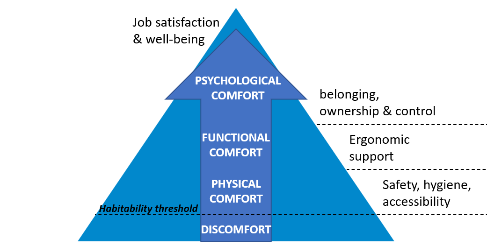
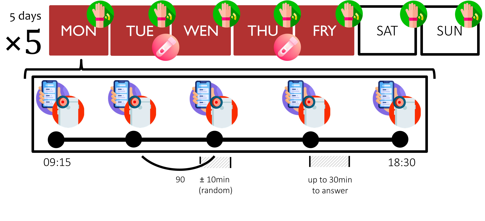
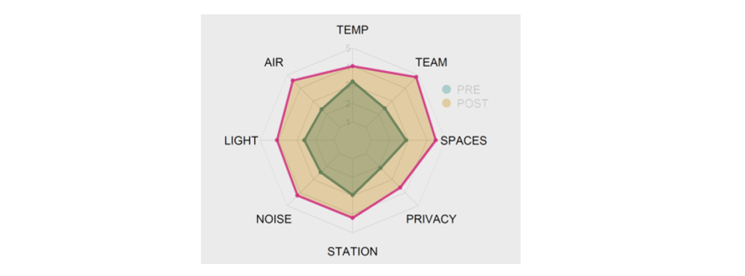

La consulenza di ricerca svolta per [Consorzio per il Trasferimento Tecnologico C2T](https://www.consorzioc2t.it/progetti/) aveva l'obiettivo di valutare l'impatto di cambiamenti in alcune caratteristiche degli spazi lavorativi su molteplici **indicatori psicofisiologici di salute e benessere**. La ricerca è stata condotta con un gruppo di lavoratrici e lavoratori che stavano per affrontare una serie di **cambiamenti nei propri spazi lavorativi**, in particolare per quanto riguarda il sistema di illuminazione, l'estetica degli spazi e il layout degli uffici.

La letteratura scientifica ha evidenziato un **ruolo saliente delle caratteristiche fisiche del luogo di lavoro per la salute e il benessere dei lavoratori** [[1-3]](#riferimenti). Ad esempio, è nota la rilevanza dei livelli di illuminazione per lo svolgimento ottimale delle attività lavorative (es. per evitare affaticamento deli occhi e migliorare la concentrazione), nonché per i [livelli di stress](/psychophysiology-of-the-stress-response-when-does-stress-cause-ilness/), il tono dell'umore, e la **qualità del sonno**. D'altra parte, il layout degli uffici è un fattore critico per gli scambi interpersonali (es. presenza di *meeting room*) e la percezione della **privacy** (es. disponibilità di uffici privati e/o insonorizzati), con potenziali ricadute su concentrazione e [stress lavorativo](/workplace-stress-and-the-management-of-psychosocial-hazards-at-work/) (es. minore numero di interruzioni) e sul **comfort percepito**. In particolare, il modello del comfort funzionale di Vischer [[3]](#riferimenti) propone una "**piramide del comfort**", in cui la soddisfazione e i livelli di salute e benessere dipendono dal progressivo raggiungimento del ***comfort fisico*** (sicurezza, igiene e accessibilità), del ***comfort funzionale*** (supporto ergonomico all'attività lavorativa) e del ***comfort psicologico*** (senso di appartenenza e controllo sull'ambiente di lavoro).

La ricerca prevedeva un protocollo di [ecological momentary assessment (EMA)](/ecological-momentary-assessment/) progettato per raccogliere misure ripetute di molteplici indicatori di salute e benessere individuale. Il protocollo, della durata di **una settimana**, è stato ripetuto in modo identico rispettivamente **prima e dopo i cambiamenti** negli spazi lavorativi. 

In entrambe le valutazioni, i partecipanti hanno risposto ad un breve questionario sul proprio benessere e **comfort percepito**. Il protocollo prevedeva poi l'uso di [metodi experience sampling](/experience-sampling-methods-measuring-experiences-in-real-time/) per rilevare il **tono dell'umore** con 5 brevi questionari nel corso di ciascuna giornata lavorativa, attraverso un'applicazione mobile open source [[4]](#riferimenti). In ciascuna rilevazione, i participanti hanno anche utilizzato una seconda app [[5]](#riferimenti) per registrare la propria **frequenza cardiaca** e [HRV](/heart-rate-variability-as-an-index-of-stress-and-self-regulation/) tramite la fotocamera dello smartphone. Inoltre, per due volte alla settimana i partecipanti hanno anche collezionato dei campioni salivari al fine di misurare la **risposta del cortisolo al risveglio**, un noto *biomarker* dei [livelli di stress](/psychophysiology-of-the-stress-response-when-does-stress-cause-ilness/). Infine, durante l'intera settimana i partecipanti hanno indossato un **attigrafo**, ovvero un [sensore *wearable*](/wearable-technology-and-e-health/) che registrava i movimenti del polso per ricavare indici oggettivi di **qualità del sonno**.

Al termine della ricerca un **report dettagliato dei livelli e dei cambiamenti** in ciascun indicatore è stato redatto e consegnato al committente, presentando i dati in forma aggregata e anonima. Diversi indicatori hanno mostrato cambiamenti sostanziali, ma l'impatto più forte è emerso per tutte le dimensioni del **comfort funzionale percepito**: illuminazione, qualità dell'aria, temperatura, , come mostrato nella figura qui sotto.

 

# Riferimenti

1. Vischer, J. C. (2008). Towards an environmental psychology of workspace: how people are affected by environments for work. *Architectural science review, 51*(2), 97‐108. https://doi.org/10.3763/asre.2008.5114

2. Kamarulzaman, N., Saleh, A. A., Hashim, S. Z., Hashim, H., & Abdul‐Ghani, A. A. (2011). An overview of the influence of physical office environments towards employee. *Procedia Engineering, 20*, 262‐268. https://doi.org/10.1016/j.proeng.2011.11.164

3. Vischer, J. C. (2007). The effects of the physical environment on job performance: towards a theoretical model of workspace stress. *Stress and Health: Journal of the International Society for the Investigation of Stress, 23*(3), 175‐184. https://doi.org/10.1002/smi.1134

4. Xiong, H., Huang, Y., Barnes, L. E., & Gerber, M. S. (2016). Sensus: A cross-platform, general-purpose system for mobile crowdsensing in human-subject studies. Proceedings of the 2016 ACM International Joint Conference on Pervasive and Ubiquitous
Computing, 415–426. https://doi.org/10.1145/2971648.2971711

5. Plews, D. J., Scott, B., Altini, M., Wood, M., Kilding, A. E., & Laursen, P. B. (2017). Comparison of heart‐rate‐variability recording with smartphone photoplethysmography, Polar H7 chest strap, and electrocardiography. *International Journal of Sports Physiology and Performance, 12*(10), 1324‐1328. https://doi.org/10.1123/ijspp.2016-0668