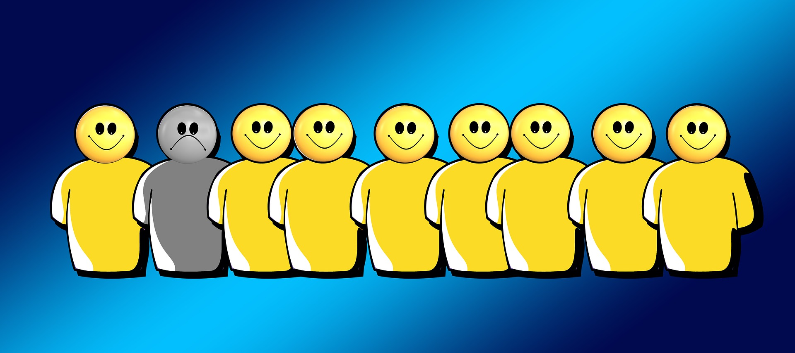

```{r setup, include=FALSE,echo=FALSE}
knitr::opts_chunk$set(collapse = TRUE)
```

***Experience Sampling Methods (ESM)*** *include a set of tools for the repeated and systematic sampling of psychological states, experiences, and activities in real time, during daily life*.

As described by [Mihaly Csikszentmihalyi](https://www.researchgate.net/profile/Mihaly-Csikszentmihalyi), one of the main ESM pioneers and developers, ESM aim at "*obtaining self-report for a representative sample of moments in people's life*" to study the **frequency, intensity and patterning** of self-reported experiences (thoughts, psychological states etc.), and daily activities (social interactions, changes in locations etc.), over time [[1]](#references).

To keep it simple, Experience Sampling means asking individuals to provide systematic self-reports by repeatedly administering **short** (e.g., max 10-20 items) and **consistent measures** (always the same questions). ESM are increasingly used in several fields of psychological research (e.g., see examples in [work](https://doi.org/10.1037/0021-9010.93.3.674), [clinical](https://doi.org/10.3389/fpsyt.2020.00214), and [personality psychology](https://doi.org/10.1073/pnas.1919934117)) due to their recognized **advantages over retrospective self-reports**.

<br>

## ESM vs. Retrospective Reports

**Retrospective self-reports** are the gold standard for measuring subjective ratings of psychological constructs, requiring respondents to rate a number of questions **referred to the past** (e.g., over the last six months, over the last year). Ratings are often given on a [Likert scale](https://methods.sagepub.com/reference/encyclopedia-of-survey-research-methods/n273.xml), with response labels being usually expressed in terms of agreement or frequency.

Here's a retrospective item often used in [workplace stress](/stress-and-workplace-stress/) research:

<iframe src="https://docs.google.com/forms/d/e/1FAIpQLSfCom9uiHbaHruWx5K1tr3j5lNgs4Lid8xQJitVoHrNs76Rxg/viewform?embedded=true" width="400" height="520" frameborder="0" marginheight="0" marginwidth="0">

Loading...</iframe>

### Recall biases

Now imagine rating the item above in the afternoon, just after an **infrequent and intense fight with your boss** you had in the morning. You're probably going to overestimate the frequency of work-related interpersonal conflicts due to the **salience** (infrequent event) and **recency** (happened this morning) of this conflictual episode.


On the "cold" (cognitive) side, salience and recency effects, and further **recall biases** such as the [availability heuristic](https://en.wikipedia.org/wiki/Availability_heuristic) are **mental shortcuts** potentially involved each time we retrieve some information from our memory. Whether these shortcuts are necessary to provide us with an adequate **cognitive efficiency** (not all information is useful), they are likely to produce systematic distortions in retrospective reports (e.g., false memories, overrating).

On the "hot" (emotional) side, **affective states** such as the momentary respondent's mood can interfere with retrieval processes as well, by driving them towards information **matching the current feeling**. For instance, the respondent might be worried or sad because of a family issue. Imagine yourself answering the following item under such a bad mood. Even if the stressor (family issue) is unrelated to your work, your rating will probably be higher than it would have been on a different day, with a different mood.

<iframe src="https://docs.google.com/forms/d/e/1FAIpQLSfh2Mad4GctaqBcja0QMqiaGYvdL7sFf6x6eQuO1AMa6rhcgw/viewform?embedded=true" width="400" height="520" frameborder="0" marginheight="0" marginwidth="0">Caricamento…</iframe>

In summary, retrospective reports are largely based on **memory retrieval**, whose accuracy is influenced by both cognitive biases (mental shortcuts) and affective states (momentary mood). In contrast, ESM are referred to the **current moment** (e.g., "*How do you feel right now?*"), minimizing memory retrieval processes, and implying less distorted data.

### Individual differences and response style

In addition to affective states, retrospective reports are also sensitive to **affective traits** and other stable **personality** characteristics such as conscientiousness, neuroticism, and hostility. 

For instance, **negative affectivity**, defined as "*a mood-dispositional dimension […] reflecting pervasive individual differences in negative emotionality and self-concept*" [[4]](#references), has been flagged as a critical confounder in workplace stress assessment. As explained in [this former post](/stress-and-workplace-stress/), stress is evaluated by measuring indicators of **stressors** (e.g., item 1: interpersonal conflict) and **strain** (e.g., item 2: perceived stress). Due to their tendency to perceive themselves and the environment as "more negative than they are", individuals with high trait negative affectivity are more likely to overrate both stressors and strain, possibly resulting in **overestimations** of the "true" relationship between the two latent constructs. 



Negative affectivity is only one of the several traits that can substantially bias self-report ratings, referred as **response styles**: the respondents' tendency to respond to survey questions in certain ways regardless of the content [[5]](#references). Although **response biases** (e.g.,[social desirability](https://methods.sagepub.com/reference/encyclopedia-of-survey-research-methods/n537.xml), [halo effect](https://en.wikipedia.org/wiki/Halo_effect)) are more likely to occur under specific conditions (e.g., low motivation and/or cognitive resources available), they are strongly affected by our typical way of retrieving information, our attributional style, and our self-concept.

Whereas retrospective reports are intrinsically linked to stable individual differences, ESM are repeated over time, implying a certain amount of **variability within-individuals**, which can be quantified net of individual differences.

<br>

### Between and within individuals

With ESM data, individual differences and response styles can be controlled by [decomposing the variance into two levels](/multilevel-modeling): the **within-individual** (level 1), and the **between-individuals** level (level 2). By sampling repeated measures of the same constructs over time, ESM allow to measure intraindividual changes around the individual mean level, thus, controlling for stable individual characteristics.

Here's an example. First, we collect multiple measures of perceived stress (item 2: *Are you feeling stressed right now?*) from the same individuals over time. 


Second, we compute the **mean score for each individual**: this will be the **between-individuals component** (level 2), expressing the mean level of stress in each individual. At level 2, the variance in item scores represents individual differences around the mean score of the sample (grand average). This is the same information that can be estimated from retrospective reports, with the only difference that with ESM measures it is computed considering multiple measures, implying higher reliability than that characterizing retrospective reports (based on a single measure from each individual). Here's how it can be visualized:

```{r echo=FALSE,warning=FALSE,message=FALSE,eval=FALSE}
# simulate ESM data from 2 participants
esm <- data.frame(ID=c(rep("person1",7),rep("person2",7)),
                  Time=rep(1:7,2),
                  Stress=c(2,5,2,3,4,2,1,  6,5,6,7,4,6,6))
means <- data.frame(ID=c("person1","person2"),Stress=c(mean(esm[esm$ID=="person1","Stress"]),
                                                       mean(esm[esm$ID=="person2","Stress"])))
library(ggplot2); library(gridExtra)
p <- grid.arrange(ggplot(means,aes(x=ID,y=Stress,col=ID))+ geom_point(size=5) + scale_y_continuous(limits=c(1,7),breaks=c(1,3,5,7)) + ylab("Stress level") + xlab("") +
                 ggtitle("Retrospective reports") + theme(legend.position = "none"),
             ggplot(esm,aes(x=ID,y=Stress,col=ID))+ geom_point() + ylim(1,8) + scale_y_continuous(breaks=c(1,3,5,7)) + ylab("Stress level") + xlab("") +
                 ggtitle("ESM reports") + stat_summary(fun=mean, geom="point", size=5)  + 
                 theme(legend.position = "none"),nrow=1)
ggsave("esm_between_subjects.PNG",plot=p,dpi=300)
col <- c("#00BFC4","#F8766D")
p <- ggplot(esm,aes(x=Time,y=Stress,col=ID))+ ylim(1,8) + ylab("Stress level") +
    ggtitle("ESM reports within individual") + stat_summary(fun=mean, geom="point", size=5) + 
    geom_smooth(span=0.6,se=FALSE,lwd=1.2,alpha=.7) + 
    geom_hline(yintercept=means$Stress[1],color=col[2],lty=2,lwd=1.5)+
    geom_hline(yintercept=means$Stress[2],color=col[1],lty=2,lwd=1.5)+ scale_y_continuous(breaks=c(1,3,5,7)) +
    theme(legend.position="none") + geom_point()
ggsave("esm_within_subjects.PNG",plot=p,dpi=300)
```


Third, each single score measured from a given individual is **mean-centered**, that is we subtract the mean score from the single observation. Tihis will be the **within-individual component** (level 1), expressing the momentary stress level net of the individual mean level. This component will tell us in which occasions (time points) the respondent is **more or less stressed than she usually is**. Most importantly, this momentary stress level will be estimated by controlling for (at least part of) the individual differences (negative affectivity, response style, etc.) that can bias the responses. Here's how it can be visualized:


**Multilevel modeling** is better described in [this former post](/multilevel-modeling), and effectively visualized in [this beautiful tutorial](http://mfviz.com/hierarchical-models/), but the essence is the following: ESM (and repeated-measure designs in general) allow to simultaneously measure individual differences (more reliably than retrospective reports due to the repeated-measure nature of the data), and momentary deviations around the mean level, allowing to model the variability in item scores by accounting for the **hierarchical data structure** (single observations nested within individual)

### The role of the context

The **high ecological validity** (generalizability to every-day life) of ESM is somehow balanced by a **low internal validity** due to the potentially large number of confounding factors that can be encountered during daily experiences (e.g., a car accident, an unexpected news, a physical injury). The **physical and social context** is a major predictor of within-individual variability in psychological states, and a well designed ESM study should include control questions to quantify the most critical contextual confounders.

For instance, a diary study investigating the daily effect of workplace stress on sleep quality should account for **stable contextual factors** unrelated to work such as the number ad age of children in the household, as well as for **transient contextual factors** such as daily family hassles (e.g., a discussion with a family member, urgent housework), leisure activities (e.g., sport, relaxation), and the daily consumption of those substances that can affect sleep quality (e.g., coffee and alcohol). Critically, only stable factors can be quantified with retrospective reports, whereas ESM potentially allow to measure both.

But the context is not just a confounder to control. In many ESM studies the context is the main subject under investigation, with changes in the context status being used to predict changes in the psychological states measured with ESM ratings. It is the case of **work sampling**, an old technique for estimating the percentage of working time spent by employees on each of a range of predefined activity categories. By systematically measuring the type of activity undertaken and the concurrent ratings of stress, social interactions, or further variables, it is possible to identify which work activities are perceived as more stressful, associated with more problematic social interactions, and so on.

### The role of time

The final and probably most important advantage of ESM over retrospective reports is the possibility to evaluate how the measured variables change and interact over time.

## Planning an ESM study

At this point, you should be aware of the many advantages (and at least some of the disadvantages) implicated by ESM. 

### Building an ESM scale

### Psychometrics of Experience Sampling Methods

Construct validity and multilevel constructs

# References

1.  Csikszentmihalyi, M., & Larson, R. (2014). Validity and reliability of the experience-sampling method. In *Flow and the foundations of positive psychology* (pp. 35-54). Springer, Dordrecht.

2. Lavrakas, P. J. (2008). *Encyclopedia of survey research methods* (Vols. 1-0). Thousand Oaks, CA: Sage Publications, Inc. https://doi.org/10.4135/9781412963947

3. Howard, G. S., Millham, J., Slaten, S., & O'donnell, L. (1981). Influence of subject response style effects on retrospective measures. *Applied Psychological Measurement, 5(*1), 89-100. https://doi.org/10.1177%2F014662168100500113

4. Watson, D., & Clark, L. A. (1984). Negative affectivity: The disposition to experience aversive emotional states. *Psychological Bulletin, 96*(3), 465–490. https://doi.org/10.1037/0033-2909.96.3.465

5. Van Vaerenbergh, Y., & Thomas, T. D. (2013). Response styles in survey research: A literature review of antecedents, consequences, and remedies.* International Journal of Public Opinion Research, 25*(2), 195-217. https://doi.org/10.1093/ijpor/eds021

